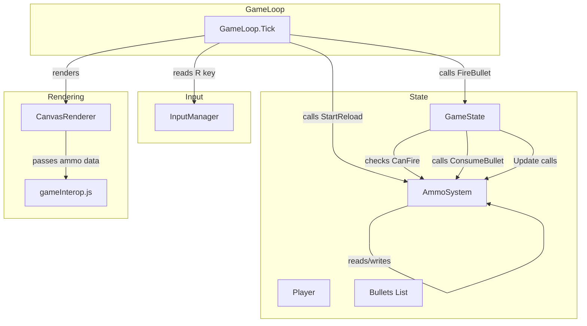
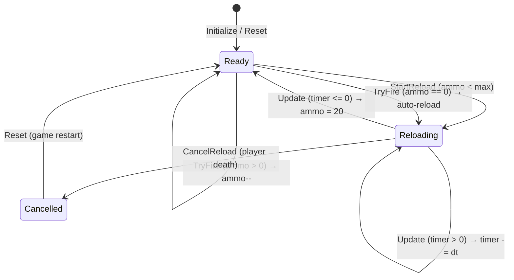

# Design Document: Ammo System

## Overview

The ammo system adds resource management to Frogmageddon by limiting the player's ability to fire bullets. The player has a 20-round magazine that must be manually reloaded (R key) or auto-reloads when firing on empty. Reloading takes 2 seconds and blocks firing. The system provides visual feedback through an ammo counter HUD and a reload progress bar above the player.

The design introduces a single `AmmoSystem` class that encapsulates all magazine and reload state. It integrates into the existing game loop via the `GameState.Update()` and `GameState.FireBullet()` methods, with rendering additions passed to the JavaScript layer through the existing `CanvasRenderer`.

## Architecture



**Key design decisions:**

1. **AmmoSystem as a standalone class** — Rather than adding fields directly to `Player` or `GameState`, the ammo state lives in its own class. This keeps the existing models focused and makes the ammo logic independently testable.

2. **GameState owns the AmmoSystem instance** — The `AmmoSystem` is a property on `GameState`, following the same pattern as `Player`, `Camera`, and `FrogSpawner`.

3. **FireBullet gating** — The existing `GameState.FireBullet()` method gains a guard clause that checks `AmmoSystem.CanFire` before spawning a bullet, and calls `AmmoSystem.ConsumeBullet()` when it does fire.

4. **Reload tick in GameState.Update()** — The reload timer decrements inside `GameState.Update()`, which is already called each frame with `deltaTime`. This ensures the timer respects the game's time scaling and pause behavior naturally (no `Update` call = no timer decrement).

## Components and Interfaces

### AmmoSystem

```csharp
namespace BlazorAsteroids.Game.Models;

public class AmmoSystem
{
    public const int MaxAmmo = 20;
    public const float ReloadDuration = 2.0f;

    public int CurrentAmmo { get; private set; }
    public bool IsReloading { get; private set; }
    public float ReloadTimeRemaining { get; private set; }

    // Computed properties
    public bool CanFire => CurrentAmmo > 0 && !IsReloading;
    public float ReloadProgress => IsReloading
        ? 1f - (ReloadTimeRemaining / ReloadDuration)
        : 0f;

    public AmmoSystem();
    public bool TryFire();
    public void StartReload();
    public void CancelReload();
    public void Update(float deltaTime);
    public void Reset();
    public string GetHudText();
}
```

**Method responsibilities:**

| Method | Description |
|--------|-------------|
| `TryFire()` | Returns `true` and decrements ammo if `CanFire`. If ammo is 0 and not reloading, triggers auto-reload and returns `false`. If reloading, returns `false` without side effects. |
| `StartReload()` | Begins reload if ammo < max and not already reloading. No-ops otherwise. |
| `CancelReload()` | Exits reloading state without restoring ammo. Called on player death. |
| `Update(float deltaTime)` | Decrements `ReloadTimeRemaining` by `deltaTime`. When timer hits 0, sets `CurrentAmmo = MaxAmmo` and `IsReloading = false`. |
| `Reset()` | Sets `CurrentAmmo = MaxAmmo`, `IsReloading = false`, `ReloadTimeRemaining = 0`. Called on game restart. |
| `GetHudText()` | Returns formatted string `"{CurrentAmmo}/{MaxAmmo}"`. |

### InputManager Changes

Add `"r"` to the `ValidKeys` set in `InputManager`:

```csharp
private static readonly HashSet<string> ValidKeys = new() { "w", "a", "s", "d", "enter", "r" };
```

No interface changes required — `IsKeyPressed("r")` already works via the existing `IInputManager` contract.

### GameState Changes

```csharp
public class GameState : IGameState
{
    // New property
    public AmmoSystem AmmoSystem { get; set; } = new();

    public void Update(float deltaTime, Vector2 movementDirection, Vector2 cursorWorldPosition)
    {
        // ... existing update logic ...

        // Add: Update ammo system reload timer
        AmmoSystem.Update(deltaTime);
    }

    public void FireBullet(Vector2 targetWorld)
    {
        // Add: Gate firing through AmmoSystem
        if (!AmmoSystem.TryFire())
            return;

        // ... existing bullet spawning logic ...
    }
}
```

### GameLoop Changes

In the `Playing` phase section of `Tick()`:

```csharp
// Check for reload input (R key)
if (_inputManager.IsKeyPressed("r"))
{
    _gameState.AmmoSystem.StartReload();
}
```

In `RestartGame()`:

```csharp
_gameState.AmmoSystem.Reset();
```

On player death (when `Health <= 0`):

```csharp
if (_gameState.Player.Health <= 0)
{
    _gameState.AmmoSystem.CancelReload();
    _currentPhase = GamePhase.GameOver;
}
```

### CanvasRenderer Changes

The `RenderAsync` method passes ammo HUD data and reload progress bar data to JavaScript:

```csharp
public async Task RenderAsync(GameState state)
{
    // ... existing render logic ...

    // Pass ammo system state for HUD and progress bar rendering
    await _module.InvokeVoidAsync("renderFrame",
        _canvas,
        // ... existing parameters ...
        state.AmmoSystem.CurrentAmmo,
        state.AmmoSystem.MaxAmmo,
        state.AmmoSystem.IsReloading,
        state.AmmoSystem.ReloadProgress);
}
```

The JavaScript `renderFrame` function renders:
- **Ammo HUD**: Text `"{current}/{max}"` in the bottom-right corner, 16px+ font, white text, positioned within 32px margin from canvas edges.
- **Reload Progress Bar**: A 40×6 pixel bar centered above the player (20px above top edge), with a filled portion from left to right proportional to `ReloadProgress`.

## Data Models

### AmmoSystem State

| Field | Type | Default | Description |
|-------|------|---------|-------------|
| `CurrentAmmo` | `int` | `20` | Rounds remaining in magazine |
| `IsReloading` | `bool` | `false` | Whether reload is in progress |
| `ReloadTimeRemaining` | `float` | `0f` | Seconds left until reload completes |

### Constants

| Constant | Value | Description |
|----------|-------|-------------|
| `MaxAmmo` | `20` | Magazine capacity |
| `ReloadDuration` | `2.0f` | Reload time in seconds |

### State Transitions



## Correctness Properties

*A property is a characteristic or behavior that should hold true across all valid executions of a system — essentially, a formal statement about what the system should do. Properties serve as the bridge between human-readable specifications and machine-verifiable correctness guarantees.*

### Property 1: Reset always restores full magazine

*For any* AmmoSystem state (any currentAmmo value in [0..20], any IsReloading state, any ReloadTimeRemaining value), calling `Reset()` SHALL result in `CurrentAmmo == 20`, `IsReloading == false`, and `ReloadTimeRemaining == 0`.

**Validates: Requirements 1.3**

### Property 2: Firing decreases ammo by exactly 1

*For any* AmmoSystem where `CurrentAmmo` is in [1..20] and `IsReloading` is false, calling `TryFire()` SHALL return `true` and result in `CurrentAmmo` being exactly one less than before the call.

**Validates: Requirements 2.1**

### Property 3: Ammo non-negative invariant

*For any* sequence of `TryFire()`, `StartReload()`, `Update(deltaTime)`, and `Reset()` calls with valid arguments, `CurrentAmmo` SHALL never be less than 0.

**Validates: Requirements 2.4**

### Property 4: CanFire iff ammo > 0 and not reloading

*For any* AmmoSystem state, `CanFire` SHALL return `true` if and only if `CurrentAmmo > 0` AND `IsReloading == false`.

**Validates: Requirements 2.2, 6.1**

### Property 5: StartReload transitions when ammo below max

*For any* AmmoSystem where `CurrentAmmo` is in [0..19] and `IsReloading` is false, calling `StartReload()` SHALL result in `IsReloading == true` and `ReloadTimeRemaining == ReloadDuration`.

**Validates: Requirements 3.1**

### Property 6: Active reload timer is not restarted

*For any* AmmoSystem where `IsReloading` is true and `ReloadTimeRemaining` is in (0..ReloadDuration], calling `StartReload()` or `TryFire()` SHALL NOT change `ReloadTimeRemaining`.

**Validates: Requirements 3.3, 4.3**

### Property 7: Reload completion restores full magazine

*For any* AmmoSystem in a reloading state with `ReloadTimeRemaining` of value `t` where `t > 0`, calling `Update(deltaTime)` where `deltaTime >= t` SHALL result in `CurrentAmmo == MaxAmmo` and `IsReloading == false`.

**Validates: Requirements 5.2**

### Property 8: Cancel reload preserves current ammo

*For any* AmmoSystem in a reloading state with any `CurrentAmmo` value, calling `CancelReload()` SHALL result in `IsReloading == false` with `CurrentAmmo` unchanged from its value before the call.

**Validates: Requirements 5.3**

### Property 9: HUD text format

*For any* `CurrentAmmo` value in [0..20], `GetHudText()` SHALL return a string matching the pattern `"{CurrentAmmo}/{MaxAmmo}"` (e.g., "8/20", "0/20", "20/20").

**Validates: Requirements 7.2**

### Property 10: Reload progress ratio

*For any* AmmoSystem in a reloading state, `ReloadProgress` SHALL equal `(ReloadDuration - ReloadTimeRemaining) / ReloadDuration`, producing a value in [0..1].

**Validates: Requirements 8.2**

## Error Handling

| Scenario | Handling |
|----------|----------|
| `TryFire()` called when ammo is 0 and not reloading | Auto-triggers `StartReload()`, returns `false` |
| `TryFire()` called while reloading | Returns `false`, no state change |
| `StartReload()` called with full ammo | No-op, returns without state change |
| `StartReload()` called while already reloading | No-op, timer not restarted |
| `Update()` with negative deltaTime | Clamp to 0 (or skip). Already handled by GameLoop's `MAX_DELTA_TIME` guard. |
| `Update()` overshoots timer (timer goes negative) | Clamp `ReloadTimeRemaining` to 0, complete reload in that frame |
| Player dies mid-reload | `CancelReload()` exits reload state without restoring ammo |

## Testing Strategy

### Property-Based Tests (using FsCheck or similar .NET PBT library)

Each correctness property maps to a property-based test with minimum 100 iterations:

- **Property tests target the `AmmoSystem` class directly** — it's a pure state machine with no external dependencies, making it ideal for PBT.
- Use generators for:
  - `currentAmmo`: integers in [0..20]
  - `isReloading`: boolean
  - `reloadTimeRemaining`: floats in [0..2.0]
  - `deltaTime`: positive floats in (0..0.1] (realistic frame times)
  - Action sequences: random lists of `TryFire | StartReload | Update(dt) | Reset | CancelReload`

**Configuration:**
- Library: FsCheck (or fast-check if testing via TypeScript)
- Minimum iterations: 100 per property
- Tag format: `Feature: ammo-system, Property {N}: {title}`

### Unit Tests (example-based)

| Test | Validates |
|------|-----------|
| Initial state has 20 ammo, not reloading | Req 1.1, 1.2 |
| Fire with 0 ammo triggers auto-reload | Req 4.1, 4.2 |
| StartReload at full ammo is no-op | Req 3.2 |
| HUD shows "0/20" at zero ammo | Req 7.4 |
| InputManager accepts 'r' key | Req 9.1, 9.2, 9.3 |

### Integration Tests

| Test | Validates |
|------|-----------|
| GameLoop passes R key press to AmmoSystem.StartReload | Req 3.1, 9.2 |
| GameLoop calls AmmoSystem.Reset on restart | Req 1.3 |
| GameLoop calls CancelReload on player death | Req 5.3 |
| Renderer shows HUD only during Playing phase | Req 7.5 |
| Renderer shows progress bar only while reloading | Req 8.1, 8.3 |
| Fire clicks during reload are discarded (not queued) | Req 6.2 |
| Reload timer does not tick when game is not in Playing phase | Req 5.4 |
