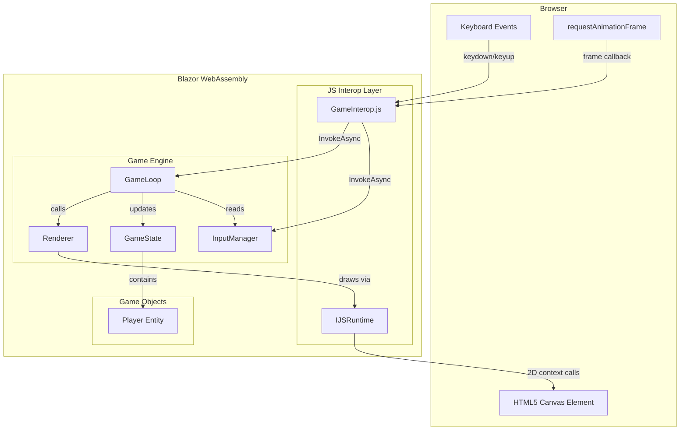
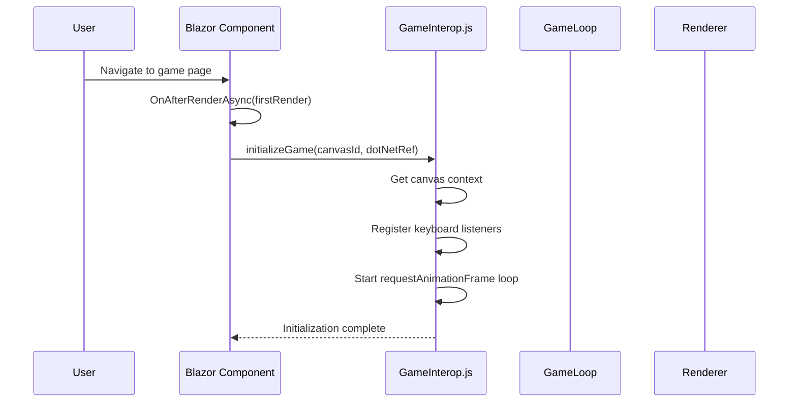
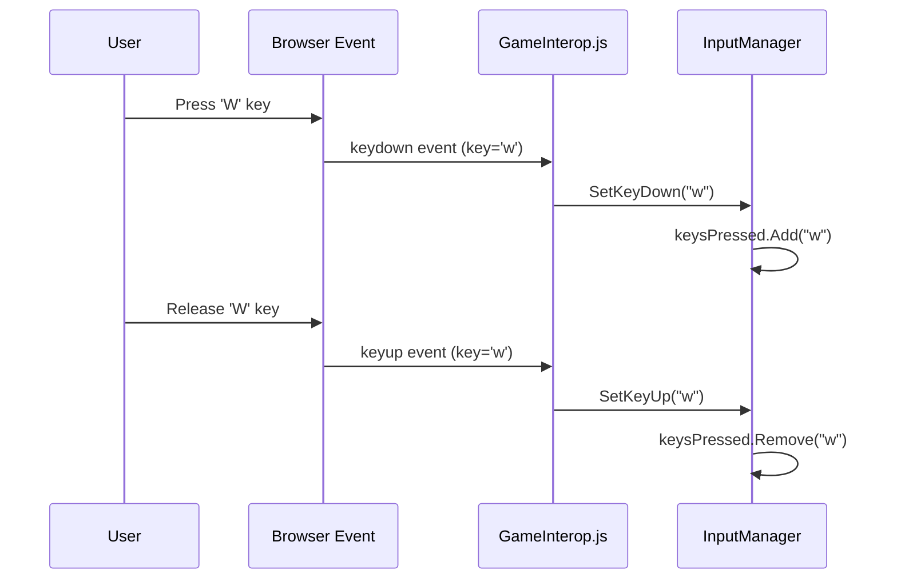

# Design Document: Blazor Asteroids Game

## Overview

This feature implements a simple top-down 2D game rendered in a Blazor WebAssembly application. The initial scope focuses on rendering a player character on an HTML5 Canvas and enabling movement via WASD keyboard input. The game uses a standard game loop pattern (update/render cycle) driven by `requestAnimationFrame` through JavaScript interop, with all game state and logic managed in C#.

The architecture separates concerns into a game loop orchestrator, input handling, game state management, and canvas rendering. Blazor WebAssembly hosts the application, while a thin JavaScript interop layer bridges the gap between the browser's animation frame API / keyboard events and the C# game engine.

## Architecture



## Sequence Diagrams

### Game Initialization



### Game Loop Tick

```mermaid
sequenceDiagram
    participant RAF as requestAnimationFrame
    participant JS as GameInterop.js
    participant Loop as GameLoop
    participant Input as InputManager
    participant State as GameState
    participant Player as Player
    participant Renderer as Renderer

    RAF->>JS: animationFrame(timestamp)
    JS->>Loop: Tick(deltaTime)
    Loop->>Input: GetMovementDirection()
    Input-->>Loop: Vector2(dx, dy)
    Loop->>State: Update(deltaTime, direction)
    State->>Player: Move(direction, deltaTime)
    Player->>Player: ClampToCanvas(bounds)
    Loop->>Renderer: Render(gameState)
    Renderer->>JS: clearCanvas()
    Renderer->>JS: drawPlayer(x, y, rotation)
```

### Keyboard Input Flow



## Components and Interfaces

### Component 1: GameLoop

**Purpose**: Orchestrates the update/render cycle each frame. Receives delta time from the JS animation frame callback, processes input, updates game state, and triggers rendering.

```csharp
public interface IGameLoop
{
    Task InitializeAsync(ElementReference canvas);
    void Tick(float deltaTimeMs);
    void Stop();
}
```

**Responsibilities**:
- Calculate delta time between frames
- Coordinate update and render phases
- Manage game running state

### Component 2: InputManager

**Purpose**: Tracks which keys are currently pressed and translates raw key state into game-meaningful movement directions.

```csharp
public interface IInputManager
{
    void SetKeyDown(string key);
    void SetKeyUp(string key);
    Vector2 GetMovementDirection();
    bool IsKeyPressed(string key);
}
```

**Responsibilities**:
- Maintain set of currently pressed keys
- Translate WASD keys into a normalized direction vector
- Handle simultaneous key presses (e.g., W+D for diagonal movement)

### Component 3: Renderer

**Purpose**: Draws the current game state to the HTML5 Canvas via JS interop calls.

```csharp
public interface IRenderer
{
    Task InitializeAsync(ElementReference canvas);
    Task RenderAsync(GameState state);
    Task ClearAsync();
}
```

**Responsibilities**:
- Clear the canvas each frame
- Draw the player character (triangle ship shape)
- Manage canvas dimensions and scaling

### Component 4: GameState

**Purpose**: Holds all game entity data and applies updates based on input.

```csharp
public interface IGameState
{
    Player Player { get; }
    int CanvasWidth { get; }
    int CanvasHeight { get; }
    void Update(float deltaTime, Vector2 movementDirection);
}
```

**Responsibilities**:
- Store player entity and canvas bounds
- Apply movement to player based on input direction
- Enforce boundary constraints

## Data Models

### Vector2

```csharp
public struct Vector2
{
    public float X { get; set; }
    public float Y { get; set; }

    public Vector2(float x, float y)
    {
        X = x;
        Y = y;
    }

    public float Length() => MathF.Sqrt(X * X + Y * Y);

    public Vector2 Normalized()
    {
        float len = Length();
        if (len == 0) return new Vector2(0, 0);
        return new Vector2(X / len, Y / len);
    }

    public static Vector2 operator +(Vector2 a, Vector2 b) => new(a.X + b.X, a.Y + b.Y);
    public static Vector2 operator *(Vector2 v, float scalar) => new(v.X * scalar, v.Y * scalar);
}
```

**Validation Rules**:
- Normalized direction vector always has length <= 1.0
- Zero vector represents no movement

### Player

```csharp
public class Player
{
    public Vector2 Position { get; set; }
    public float Speed { get; set; }
    public float Size { get; set; }
    public float Rotation { get; set; }
}
```

**Validation Rules**:
- Position must remain within canvas bounds (0 to CanvasWidth/Height)
- Speed is a positive constant (pixels per second)
- Size is the radius for boundary calculations
- Rotation is in radians, represents facing direction

### GameState

```csharp
public class GameState
{
    public Player Player { get; set; }
    public int CanvasWidth { get; set; }
    public int CanvasHeight { get; set; }
}
```

## Algorithmic Pseudocode

### Game Loop Tick Algorithm

```csharp
// Called each animation frame by JS interop
public void Tick(float deltaTimeMs)
{
    // PRECONDITION: deltaTimeMs >= 0
    // PRECONDITION: game is in running state

    float deltaTimeSec = deltaTimeMs / 1000f;

    // Cap delta time to prevent large jumps (e.g., tab was backgrounded)
    deltaTimeSec = MathF.Min(deltaTimeSec, MAX_DELTA_TIME);

    // Phase 1: Read Input
    Vector2 direction = inputManager.GetMovementDirection();

    // Phase 2: Update State
    gameState.Update(deltaTimeSec, direction);

    // Phase 3: Render
    renderer.RenderAsync(gameState);

    // POSTCONDITION: Player position is within canvas bounds
    // POSTCONDITION: Frame has been rendered to canvas
}
```

### Movement Direction Calculation

```csharp
public Vector2 GetMovementDirection()
{
    // PRECONDITION: keysPressed is a valid set of key strings
    // POSTCONDITION: returned vector has length <= 1.0

    float x = 0;
    float y = 0;

    if (IsKeyPressed("w")) y -= 1; // Up
    if (IsKeyPressed("s")) y += 1; // Down
    if (IsKeyPressed("a")) x -= 1; // Left
    if (IsKeyPressed("d")) x += 1; // Right

    Vector2 direction = new Vector2(x, y);

    // Normalize to prevent faster diagonal movement
    if (direction.Length() > 0)
    {
        direction = direction.Normalized();
    }

    // INVARIANT: direction.Length() <= 1.0
    return direction;
}
```

### Player Movement and Boundary Clamping

```csharp
public void Update(float deltaTime, Vector2 movementDirection)
{
    // PRECONDITION: deltaTime >= 0
    // PRECONDITION: movementDirection.Length() <= 1.0

    // Apply velocity: position += direction * speed * dt
    Vector2 velocity = movementDirection * Speed * deltaTime;
    Position = Position + velocity;

    // Clamp to canvas bounds
    // LOOP INVARIANT: N/A (no loop)
    Position = new Vector2(
        MathF.Clamp(Position.X, Size, canvasWidth - Size),
        MathF.Clamp(Position.Y, Size, canvasHeight - Size)
    );

    // Update rotation to face movement direction (if moving)
    if (movementDirection.Length() > 0)
    {
        Rotation = MathF.Atan2(movementDirection.Y, movementDirection.X);
    }

    // POSTCONDITION: Position.X in [Size, canvasWidth - Size]
    // POSTCONDITION: Position.Y in [Size, canvasHeight - Size]
}
```

## Key Functions with Formal Specifications

### Function: Tick(deltaTimeMs)

```csharp
void Tick(float deltaTimeMs)
```

**Preconditions:**
- `deltaTimeMs >= 0`
- Game loop is in running state
- Canvas and renderer are initialized

**Postconditions:**
- Game state is advanced by clamped delta time
- Player position remains within canvas bounds
- Canvas has been cleared and redrawn with current state

**Loop Invariants:** N/A (single-pass per frame)

### Function: GetMovementDirection()

```csharp
Vector2 GetMovementDirection()
```

**Preconditions:**
- InputManager has been initialized
- keysPressed set is in valid state

**Postconditions:**
- Returns Vector2 with `Length() <= 1.0`
- Returns `(0, 0)` if no movement keys are pressed
- Diagonal movement is normalized (no speed advantage)

**Loop Invariants:** N/A

### Function: Player.Update(deltaTime, direction)

```csharp
void Update(float deltaTime, Vector2 movementDirection)
```

**Preconditions:**
- `deltaTime >= 0`
- `movementDirection.Length() <= 1.0`
- Canvas bounds are set and positive

**Postconditions:**
- `Position.X` ∈ [`Size`, `canvasWidth - Size`]
- `Position.Y` ∈ [`Size`, `canvasHeight - Size`]
- If `movementDirection.Length() > 0`, `Rotation` reflects movement direction
- If `movementDirection.Length() == 0`, `Rotation` unchanged

**Loop Invariants:** N/A

### Function: RenderAsync(gameState)

```csharp
Task RenderAsync(GameState state)
```

**Preconditions:**
- Canvas context is initialized
- `state` is not null
- `state.Player` is not null

**Postconditions:**
- Canvas is cleared of previous frame
- Player is drawn at `state.Player.Position` with `state.Player.Rotation`
- No game state is modified (pure rendering)

**Loop Invariants:** N/A

## Example Usage

```csharp
// Game page component (GamePage.razor)
@page "/game"
@inject IJSRuntime JSRuntime

<canvas @ref="canvasRef" width="800" height="600" tabindex="0"></canvas>

@code {
    private ElementReference canvasRef;
    private GameLoop gameLoop;

    protected override async Task OnAfterRenderAsync(bool firstRender)
    {
        if (firstRender)
        {
            var inputManager = new InputManager();
            var renderer = new CanvasRenderer(JSRuntime);
            var gameState = new GameState
            {
                CanvasWidth = 800,
                CanvasHeight = 600,
                Player = new Player
                {
                    Position = new Vector2(400, 300),
                    Speed = 200f,
                    Size = 15f,
                    Rotation = 0f
                }
            };

            gameLoop = new GameLoop(inputManager, gameState, renderer);
            await gameLoop.InitializeAsync(canvasRef);
        }
    }
}
```

```javascript
// wwwroot/js/gameInterop.js
let gameInstance = null;

export function initializeGame(canvasId, dotNetRef) {
    const canvas = document.getElementById(canvasId);
    const ctx = canvas.getContext('2d');
    let lastTimestamp = 0;

    // Keyboard handling
    document.addEventListener('keydown', (e) => {
        dotNetRef.invokeMethodAsync('SetKeyDown', e.key.toLowerCase());
    });

    document.addEventListener('keyup', (e) => {
        dotNetRef.invokeMethodAsync('SetKeyUp', e.key.toLowerCase());
    });

    // Game loop via requestAnimationFrame
    function gameLoop(timestamp) {
        const deltaTime = timestamp - lastTimestamp;
        lastTimestamp = timestamp;
        dotNetRef.invokeMethodAsync('Tick', deltaTime);
        requestAnimationFrame(gameLoop);
    }

    requestAnimationFrame(gameLoop);
}

export function clearCanvas(ctx) { /* ... */ }
export function drawPlayer(ctx, x, y, rotation, size) { /* ... */ }
```

## Correctness Properties

*A property is a characteristic or behavior that should hold true across all valid executions of a system—essentially, a formal statement about what the system should do. Properties serve as the bridge between human-readable specifications and machine-verifiable correctness guarantees.*

### Property 1: Boundary Invariant

*For any* player position, speed, movement direction, and delta time, after calling `Player.Update()`, the resulting position X is in [`Player.Size`, `CanvasWidth - Player.Size`] and position Y is in [`Player.Size`, `CanvasHeight - Player.Size`].

**Validates: Requirements 4.2**

### Property 2: Normalized Movement

*For any* combination of WASD key states, `GetMovementDirection()` returns a Vector2 with `Length() <= 1.0`. Diagonal movement never exceeds the speed of cardinal movement.

**Validates: Requirements 3.4**

### Property 3: No Movement Without Input

*For any* player state where no WASD keys are pressed, calling `GetMovementDirection()` returns `(0, 0)` and applying an update with that direction does not change the player position.

**Validates: Requirements 3.5, 4.3**

### Property 4: Frame Independence

*For any* movement direction and total time interval, the final player position is the same whether the interval is divided into N frames or M frames (assuming no boundary clamping occurs).

**Validates: Requirements 4.4**

### Property 5: Rotation Consistency

*For any* movement direction, if the direction has non-zero length then the player rotation equals `atan2(direction.Y, direction.X)` after update; if the direction is zero, rotation remains unchanged from its previous value.

**Validates: Requirements 5.1, 5.2**

### Property 6: Rendering Purity

*For any* game state, calling `RenderAsync(state)` does not modify any field of the game state. The state before and after rendering is identical.

**Validates: Requirements 6.3**

### Property 7: Unrecognized Keys Ignored

*For any* key string that is not one of "w", "a", "s", or "d", calling `SetKeyDown` with that key does not affect the output of `GetMovementDirection()`.

**Validates: Requirements 8.1**

### Property 8: Key Combination Direction

*For any* subset of WASD keys pressed simultaneously, `GetMovementDirection()` returns a vector whose components correctly reflect the sum of individual key contributions (W=-Y, S=+Y, A=-X, D=+X) before normalization.

**Validates: Requirements 3.3**

## Error Handling

### Error Scenario 1: Large Delta Time Spike

**Condition**: Browser tab is backgrounded and returns, causing a large delta time (e.g., 5+ seconds)
**Response**: Cap delta time at `MAX_DELTA_TIME` (e.g., 0.1 seconds) to prevent player teleportation
**Recovery**: Game continues normally from next frame

### Error Scenario 2: Canvas Context Loss

**Condition**: Browser reclaims canvas GPU resources
**Response**: Detect context loss event, pause rendering
**Recovery**: Re-initialize canvas context on `contextrestored` event

### Error Scenario 3: JS Interop Failure

**Condition**: JavaScript interop call fails (e.g., canvas element not found)
**Response**: Log error, display user-friendly message on the Blazor component
**Recovery**: Offer retry initialization button

## Testing Strategy

### Unit Testing Approach

- Test `Vector2` operations (normalization, addition, scaling)
- Test `InputManager.GetMovementDirection()` for all key combinations
- Test `Player.Update()` boundary clamping for edge positions
- Test delta time capping logic
- Use xUnit as the test framework

### Property-Based Testing Approach

**Property Test Library**: FsCheck (with xUnit integration)

- Property: Movement direction is always normalized (length <= 1.0) for any combination of keys
- Property: Player position is always within bounds after any sequence of updates
- Property: Movement distance scales linearly with delta time

### Integration Testing Approach

- Test full game loop tick cycle with mocked JS interop
- Verify that input → state update → render pipeline executes correctly
- Test initialization sequence with Blazor test host (bUnit)

## Performance Considerations

- **JS Interop Overhead**: Minimize per-frame JS interop calls. Batch canvas draw operations into a single interop call per frame rather than individual `drawLine`, `drawArc` calls.
- **Allocation Pressure**: Use `struct` for `Vector2` to avoid GC pressure on each frame.
- **Frame Budget**: Target 60fps (16.67ms per frame). All C# game logic and JS rendering must complete within this budget.
- **Canvas Size**: Fixed 800x600 canvas keeps draw calls minimal for this scope.

## Security Considerations

- **Input Validation**: Only process recognized keys (W, A, S, D). Ignore all other keyboard input in the game loop.
- **JS Interop Surface**: The `[JSInvokable]` methods (`SetKeyDown`, `SetKeyUp`, `Tick`) validate parameter types and ranges before processing.
- **No Server Communication**: Entirely client-side; no network attack surface for the game logic.

## Dependencies

| Dependency | Purpose | Version |
|---|---|---|
| Microsoft.AspNetCore.Components.WebAssembly | Blazor WASM host | .NET 8+ |
| HTML5 Canvas API | 2D rendering | Browser native |
| requestAnimationFrame | Game loop timing | Browser native |
| xUnit | Unit testing | Latest |
| FsCheck.Xunit | Property-based testing | Latest |
| bUnit | Blazor component testing | Latest |
