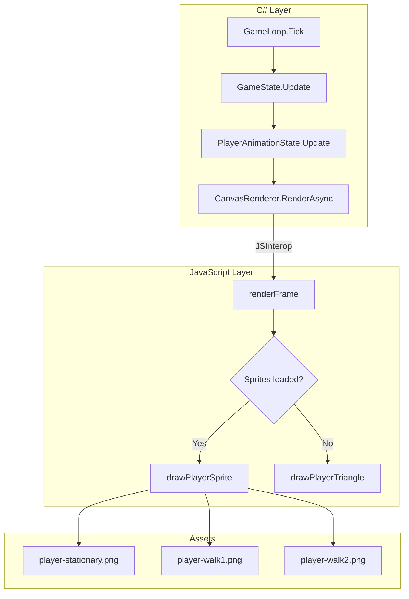

# Design Document: Character Sprite Animation

## Overview

This design introduces a sprite-based animation system for the player character in Frogmageddon, replacing the current cyan triangle placeholder. The system operates across the C#/JavaScript boundary: C# manages animation state (frame index, elapsed time, facing direction) while JavaScript handles image loading, sprite drawing, and horizontal mirroring on the HTML5 Canvas.

The animation uses three PNG sprite images to produce a four-frame walk cycle (walk1 → stationary → walk2 → stationary) that loops while the player moves. The cycle rate increases by 1.3x during sprinting. When movement stops, the character displays the stationary sprite. Facing direction is tracked from horizontal input and sprites are mirrored when facing left. A fallback to the existing triangle rendering is preserved if sprite assets fail to load.

## Architecture

The animation system is split across two layers following the existing interop pattern:



**Key design decisions:**

1. **Animation state lives in C#** — The `PlayerAnimationState` model is updated each frame in `GameState.Update()`, keeping all game logic in C#. This makes the animation state deterministic, testable, and synchronized with the game loop's deltaTime.

2. **Sprite rendering lives in JavaScript** — Image loading, canvas drawing, mirroring transforms, and damage flash overlays are handled in `gameInterop.js`. This avoids costly per-frame JSInterop round trips for image data.

3. **Data passed via existing RenderAsync call** — Animation state (frame index, facing direction) is passed as additional parameters to the existing `renderFrame` JS function, extending rather than replacing the current interop contract.

4. **Graceful fallback** — If sprite images fail to load, the JS side falls back to the triangle rendering. The C# side always computes animation state regardless of load status.

## Components and Interfaces

### New C# Components

#### `PlayerAnimationState` (Model)

A new model class in `Game/Models/` that encapsulates all animation state for the player character.

```csharp
namespace BlazorAsteroids.Game.Models;

public enum FacingDirection
{
    Right = 0,
    Left = 1
}

public class PlayerAnimationState
{
    public const float BaseFrameDuration = 0.150f; // 150ms per frame
    public const float SprintAnimationMultiplier = 1.3f;
    public const int WalkCycleLength = 4; // walk1, stationary, walk2, stationary

    // Walk cycle frame sequence: indices into sprite array
    // 0 = stationary, 1 = walk1, 2 = walk2
    private static readonly int[] WalkCycleFrames = { 1, 0, 2, 0 };

    public int CurrentCyclePosition { get; private set; } = 0;
    public float ElapsedFrameTime { get; private set; } = 0f;
    public FacingDirection Facing { get; private set; } = FacingDirection.Right;

    /// <summary>
    /// The sprite index to render (0=stationary, 1=walk1, 2=walk2).
    /// </summary>
    public int CurrentSpriteIndex => WalkCycleFrames[CurrentCyclePosition];

    /// <summary>
    /// Updates the animation state for the current frame.
    /// </summary>
    public void Update(float deltaTime, Vector2 movementDirection, bool isSprinting)
    {
        // Update facing direction based on horizontal input
        if (movementDirection.X > 0)
            Facing = FacingDirection.Right;
        else if (movementDirection.X < 0)
            Facing = FacingDirection.Left;
        // If X == 0, retain previous facing direction

        // If not moving, reset to stationary
        if (movementDirection.Length() == 0)
        {
            CurrentCyclePosition = 0;
            ElapsedFrameTime = 0f;
            return;
        }

        // Accumulate elapsed time with sprint multiplier
        float effectiveDuration = BaseFrameDuration / (isSprinting ? SprintAnimationMultiplier : 1.0f);
        ElapsedFrameTime += deltaTime;

        // Advance frames
        while (ElapsedFrameTime >= effectiveDuration)
        {
            ElapsedFrameTime -= effectiveDuration;
            CurrentCyclePosition = (CurrentCyclePosition + 1) % WalkCycleLength;
        }
    }

    /// <summary>
    /// Resets animation to initial state (stationary, facing right).
    /// </summary>
    public void Reset()
    {
        CurrentCyclePosition = 0;
        ElapsedFrameTime = 0f;
        Facing = FacingDirection.Right;
    }
}
```

### Modified C# Components

#### `GameState` — Add `PlayerAnimationState` property

```csharp
public PlayerAnimationState PlayerAnimation { get; set; } = new();
```

The `Update()` method will call `PlayerAnimation.Update(deltaTime, movementDirection, StaminaSystem.IsSprinting)` each frame.

#### `CanvasRenderer.RenderAsync` — Pass animation data to JS

Extend the `renderFrame` call to include:
- `animationFrameIndex` (int): Current sprite index (0, 1, or 2)
- `facingDirection` (int): 0 = right, 1 = left

#### `GameLoop.RestartGame` / `TransitionToPlaying` — Reset animation state

Call `_gameState.PlayerAnimation.Reset()` on game restart and start.

### Modified JavaScript Components

#### `gameInterop.js` — Sprite loading and rendering

**New module-level state:**
- `playerSprites`: Array of 3 `Image` objects
- `playerSpritesLoaded`: Boolean flag (true only when all 3 load successfully)
- Loading timeout (10 seconds)

**New function: `drawPlayerSprite(ctx, x, y, size, spriteIndex, facingLeft, isFlashing)`**
- Draws the appropriate sprite, centered on (x, y)
- Scales to fit within 2× player size (preserving aspect ratio)
- Applies horizontal flip via `ctx.scale(-1, 1)` when facing left
- Applies red tint overlay when flashing

**Modified function: `renderFrame`**
- Accepts two new parameters: `animationFrameIndex`, `facingDirection`
- Replaces the inline player triangle drawing with a call to either `drawPlayerSprite` (if loaded) or the existing triangle code (fallback)

## Data Models

### PlayerAnimationState Fields

| Field | Type | Default | Description |
|-------|------|---------|-------------|
| CurrentCyclePosition | int | 0 | Index into the 4-frame walk cycle array (0–3) |
| ElapsedFrameTime | float | 0.0 | Seconds accumulated since last frame advance |
| Facing | FacingDirection | Right | Current horizontal facing direction |

### Walk Cycle Sequence

| Cycle Position | Sprite Index | Sprite Name |
|----------------|-------------|-------------|
| 0 | 1 | walk1 |
| 1 | 0 | stationary |
| 2 | 2 | walk2 |
| 3 | 0 | stationary |

### Animation Parameters

| Parameter | Value | Description |
|-----------|-------|-------------|
| BaseFrameDuration | 150ms (0.150s) | Time each frame displays at normal speed |
| SprintAnimationMultiplier | 1.3 | Rate multiplier when sprinting |
| Effective Sprint Frame Duration | ~115ms | 150ms / 1.3 |

### RenderAsync Data Contract Extension

The `renderFrame` JS function signature extends to:

```javascript
renderFrame(canvasElement, cameraX, cameraY, playerX, playerY, rotation, size,
            frogData, bulletData, isFlashing, currentAmmo, maxAmmo,
            isReloading, reloadProgress, playerScreenX, playerScreenY,
            playerSize, staminaRatio, animationFrameIndex, facingDirection)
```

### Sprite Asset Paths

| Asset | Path |
|-------|------|
| Stationary | `./images/player-stationary.png` |
| Walk 1 | `./images/player-walk1.png` |
| Walk 2 | `./images/player-walk2.png` |


## Correctness Properties

*A property is a characteristic or behavior that should hold true across all valid executions of a system — essentially, a formal statement about what the system should do. Properties serve as the bridge between human-readable specifications and machine-verifiable correctness guarantees.*

### Property 1: Zero movement produces stationary state

*For any* `PlayerAnimationState` (regardless of current cycle position or elapsed time), when `Update` is called with a movement direction of zero magnitude and any deltaTime ≥ 0, the resulting `CurrentCyclePosition` SHALL be 0, `ElapsedFrameTime` SHALL be 0, and `CurrentSpriteIndex` SHALL be 0 (stationary).

**Validates: Requirements 2.1, 2.2, 2.3, 3.5**

### Property 2: Walk cycle sequence correctness

*For any* non-zero movement direction, when the animation advances through consecutive frame durations, the `CurrentSpriteIndex` values SHALL follow the repeating sequence [1 (walk1), 0 (stationary), 2 (walk2), 0 (stationary)], and after 4 frame advances the cycle SHALL loop back to the beginning producing the same sequence again.

**Validates: Requirements 3.1, 3.3**

### Property 3: Frame timing respects sprint multiplier

*For any* non-zero movement direction and deltaTime sequence, when `isSprinting` is false the animation SHALL advance one frame for every 150ms of accumulated time, and when `isSprinting` is true the animation SHALL advance one frame for every (150 / 1.3) ≈ 115.4ms of accumulated time. The number of frame advances SHALL equal `floor(totalElapsedTime / effectiveDuration)`.

**Validates: Requirements 3.2, 3.4, 4.1, 4.2**

### Property 4: Sprint transition preserves cycle position

*For any* `PlayerAnimationState` at cycle position P with non-zero movement, when the `isSprinting` flag changes from true to false (or vice versa) between consecutive updates, the `CurrentCyclePosition` SHALL remain at P (only the timing of future advances changes, not the current position).

**Validates: Requirements 4.3**

### Property 5: Facing direction follows horizontal input sign

*For any* movement direction with a non-zero horizontal component (X ≠ 0), after calling `Update`, the `Facing` direction SHALL be `Right` if X > 0 and `Left` if X < 0, regardless of the previous facing direction.

**Validates: Requirements 5.1, 5.2**

### Property 6: Zero horizontal input retains facing direction

*For any* `PlayerAnimationState` with a current `Facing` value of F, when `Update` is called with a movement direction whose horizontal component is exactly zero, the `Facing` direction SHALL remain F.

**Validates: Requirements 5.3**

### Property 7: Reset produces clean initial state

*For any* `PlayerAnimationState` (regardless of current field values), calling `Reset()` SHALL produce `CurrentCyclePosition` = 0, `ElapsedFrameTime` = 0.0, and `Facing` = `Right`.

**Validates: Requirements 5.4, 8.1, 8.2, 8.3, 8.4**

## Error Handling

### Sprite Load Failure (JavaScript)

- Each sprite image has a 10-second load timeout implemented via `setTimeout`
- On timeout or `onerror`, the specific failed image path is logged to `console.error`
- The `playerSpritesLoaded` flag remains `false`, triggering triangle fallback
- Partial loads (e.g., 2 of 3 succeed) still result in fallback — all 3 must succeed

### Invalid DeltaTime

- Negative deltaTime is already clamped to 0 by `GameLoop.Tick`
- Very large deltaTime (tab backgrounded) is clamped to 100ms by `MAX_DELTA_TIME`
- The `while` loop in `PlayerAnimationState.Update` handles large deltaTime correctly by advancing multiple frames as needed

### Zero-Length Movement Vector

- `Vector2.Length()` returns 0 for the zero vector — used as the idle/movement check
- No division by zero risk since we check length before any normalization

### Animation State Consistency

- `CurrentCyclePosition` is always kept in range [0, 3] via modulo arithmetic
- `ElapsedFrameTime` is always ≥ 0 (subtracted only when a frame advances)
- `Reset()` is called at game start/restart, ensuring no stale state carries over

## Testing Strategy

### Property-Based Tests (C#)

The `PlayerAnimationState` class is pure logic with no external dependencies, making it ideal for property-based testing. Use **FsCheck** (available for .NET/C#) with minimum 100 iterations per property.

Each property test should:
- Generate random `PlayerAnimationState` instances (varying cycle position, elapsed time, facing)
- Generate random valid inputs (deltaTime, movementDirection, isSprinting)
- Assert the corresponding correctness property

**Configuration:**
- Library: FsCheck.Xunit (or FsCheck with NUnit if that matches existing test setup)
- Minimum iterations: 100 per property
- Tag format: `Feature: character-sprite-animation, Property {N}: {title}`

Properties to implement:
1. Zero movement → stationary state
2. Walk cycle sequence correctness
3. Frame timing respects sprint multiplier
4. Sprint transition preserves cycle position
5. Facing direction follows horizontal input sign
6. Zero horizontal input retains facing direction
7. Reset produces clean initial state

### Unit Tests (C#)

Example-based tests for specific scenarios:
- Walk cycle produces correct first 8 frames (two full loops)
- Sprint at exactly 115.4ms advances one frame
- Facing starts as Right on construction
- Multiple zero-movement updates are idempotent

### Integration Tests (JavaScript)

- Sprite loading: verify all 3 images load from correct paths
- Fallback: verify triangle renders when images fail
- Mirror transform: verify `ctx.scale(-1, 1)` is called when facing left
- Damage flash: verify red overlay compositing when `isFlashing` is true
- Draw order: verify player sprite draws after frogs and before bullets

### Manual Verification

- Visual inspection that sprites display correctly at various sizes
- Verify no positional shift when mirroring
- Verify animation speed visually increases during sprint
- Verify smooth transitions between walking and stationary
