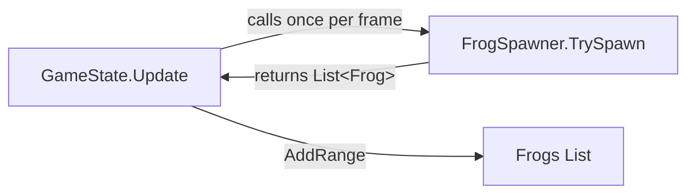

# Design Document: Frog Group Spawning

## Overview

This feature changes the frog spawning system from spawning a single frog per timer event to spawning a clustered group of 5–7 frogs per event. The base spawn interval is reduced from 3.0s to 2.0s and the max frog cap is raised from 30 to 40, producing denser waves that arrive as cohesive clusters from a single viewport edge. The `TrySpawn` return type changes from `Frog?` to `List<Frog>`, and `GameState.Update()` is updated to add the full list each frame.

## Architecture

The change is confined to two files:



**FrogSpawner** remains the sole authority on when and where frogs appear. No new classes are introduced. The clustering logic is internal to `TrySpawn`.

**GameState** changes are minimal: replace the null-check-and-add with an `AddRange` call on the returned list.

### Design Decisions

| Decision | Rationale |
|----------|-----------|
| Keep clustering logic inside `FrogSpawner` | Avoids new abstractions; the spawner already owns edge selection and position math. |
| Return `List<Frog>` (empty when suppressed) instead of `List<Frog>?` | Eliminates null checks in the caller. An empty list is semantically clearer than null. |
| Select anchor before generating offsets | Guarantees cluster cohesion—offsets are relative displacements from a known point. |
| Clamp anchor 120px from corners | Prevents frogs from clustering at viewport corners where two edges meet, which could look unnatural. |

## Components and Interfaces

### FrogSpawner (modified)

```csharp
public class FrogSpawner
{
    // Constants (changed)
    private const float BaseSpawnInterval = 2.0f;   // was 3.0f
    public int MaxFrogs { get; set; } = 40;         // was 30

    // New constants
    private const int MinGroupSize = 5;
    private const int MaxGroupSize = 7;
    private const float ClusterRadius = 120f;       // max offset from anchor along edge
    private const float AnchorCornerMargin = 120f;  // min distance from edge corners

    // Signature change
    public List<Frog> TrySpawn(float deltaTime, Camera camera, int currentFrogCount);
}
```

### GameState.Update (modified call site)

```csharp
// Before:
var newFrog = FrogSpawner.TrySpawn(deltaTime, Camera, Frogs.Count);
if (newFrog != null)
    Frogs.Add(newFrog);

// After:
var newFrogs = FrogSpawner.TrySpawn(deltaTime, Camera, Frogs.Count);
if (newFrogs.Count > 0)
    Frogs.AddRange(newFrogs);
```

## Data Models

No new data models are required. The existing `Frog` class is constructed with a `Vector2` position, which remains unchanged.

### Internal Spawn Algorithm (inside TrySpawn)

1. Accumulate `deltaTime` into `_elapsedTime`.
2. If `currentFrogCount >= MaxFrogs`, return empty list and reset timer.
3. Decrement `_spawnTimer` by `deltaTime`. If timer > 0, return empty list.
4. Reset timer to `BaseSpawnInterval / GetSpawnRateMultiplier()`.
5. Choose `groupSize` uniformly in `[5, 7]`.
6. Clamp `groupSize` to `MaxFrogs - currentFrogCount` if necessary.
7. Choose a random edge (0–3).
8. Compute the usable anchor range along the edge (edge length minus 2 × `AnchorCornerMargin`).
9. Pick the anchor point at a random position within that range.
10. For each frog in the group:
    - Offset along the edge axis = `anchor + Random(-ClusterRadius, +ClusterRadius)`.
    - Perpendicular coordinate = viewport boundary ± `SpawnMargin` (outside the edge).
11. Return the list.

## Correctness Properties

*A property is a characteristic or behavior that should hold true across all valid executions of a system—essentially, a formal statement about what the system should do. Properties serve as the bridge between human-readable specifications and machine-verifiable correctness guarantees.*

### Property 1: Group size is always 5–7 (or capped remainder)

*For any* spawn event where `currentFrogCount < MaxFrogs`, the returned list size SHALL be between `min(5, MaxFrogs - currentFrogCount)` and `min(7, MaxFrogs - currentFrogCount)`, inclusive.

**Validates: Requirements 1.1, 1.3, 5.3**

### Property 2: MaxFrogs cap invariant

*For any* `currentFrogCount` in `[0, MaxFrogs]` and any spawn event, `currentFrogCount + returnedList.Count` SHALL never exceed `MaxFrogs` (40). When `currentFrogCount == MaxFrogs`, the returned list SHALL be empty.

**Validates: Requirements 1.3, 2.3, 5.1, 5.2, 5.3**

### Property 3: Spawn rate multiplier formula

*For any* elapsed time `t ≥ 0`, the spawn rate multiplier SHALL equal: `1.0` if `t ≤ 30`, `2.0` if `t ≥ 120`, and `1.0 + (t - 30) / 90` otherwise.

**Validates: Requirements 2.2**

### Property 4: All frogs spawn on same edge at SpawnMargin

*For any* spawn event that returns a non-empty list, all frogs in the list SHALL share the same viewport edge, and their perpendicular coordinate SHALL be exactly `SpawnMargin` (50px) outside that edge's viewport boundary.

**Validates: Requirements 1.2, 3.1, 3.4**

### Property 5: Cluster spread within 240px

*For any* spawn event that returns a non-empty list, the maximum distance between any two frogs' positions along the edge axis SHALL be at most `2 × ClusterRadius` (240px).

**Validates: Requirements 3.3**

### Property 6: Anchor at least 120px from edge corners

*For any* spawn event that returns a non-empty list, the centroid of the group along the edge axis SHALL be at least `AnchorCornerMargin` (120px) from each end of that edge.

**Validates: Requirements 3.2**

### Property 7: GameState integrates all spawned frogs

*For any* list returned by `TrySpawn`, after `GameState.Update` completes, the `Frogs` list SHALL contain all frogs from the returned list (in addition to previously existing frogs).

**Validates: Requirements 4.1**

## Error Handling

| Scenario | Handling |
|----------|----------|
| Viewport dimensions are zero or negative | `TrySpawn` returns an empty list (no valid spawn positions). |
| `currentFrogCount` exceeds `MaxFrogs` (defensive) | Treat same as `== MaxFrogs`: return empty list. |
| Edge length minus `2 × AnchorCornerMargin` is ≤ 0 (very small viewport) | Fallback: place anchor at edge midpoint. |
| `deltaTime` is zero or negative | Timer does not advance; no spawn occurs. Existing behavior preserved. |

## Testing Strategy

### Property-Based Tests (using FsCheck via NUnit or xUnit)

Each correctness property above maps to a property-based test with a minimum of 100 iterations. The test library will be **FsCheck** (the standard .NET PBT library), integrated with the project's test runner.

- **Property 1–6** test `FrogSpawner.TrySpawn` directly by generating random `Camera` configurations (varying viewport sizes and positions) and random `currentFrogCount` values.
- **Property 7** tests `GameState.Update` by verifying the `Frogs` list grows by the expected count after a single update frame that triggers spawning.

Tag format: `Feature: frog-group-spawning, Property {N}: {text}`

Configuration: 100+ iterations per property test (FsCheck default is 100).

### Unit Tests (example-based)

- Verify `BaseSpawnInterval == 2.0f` (Requirement 2.1).
- Verify `MaxFrogs == 40`.
- Verify `TrySpawn` is called exactly once per `GameState.Update` frame (Requirement 4.2).
- Verify return type is `List<Frog>` (compilation check, Requirement 4.3).
- Edge case: viewport exactly 240px wide (anchor forced to midpoint).

### Integration Tests

- Full game loop frame with group spawning active: confirm frogs appear, move, and are removable.
