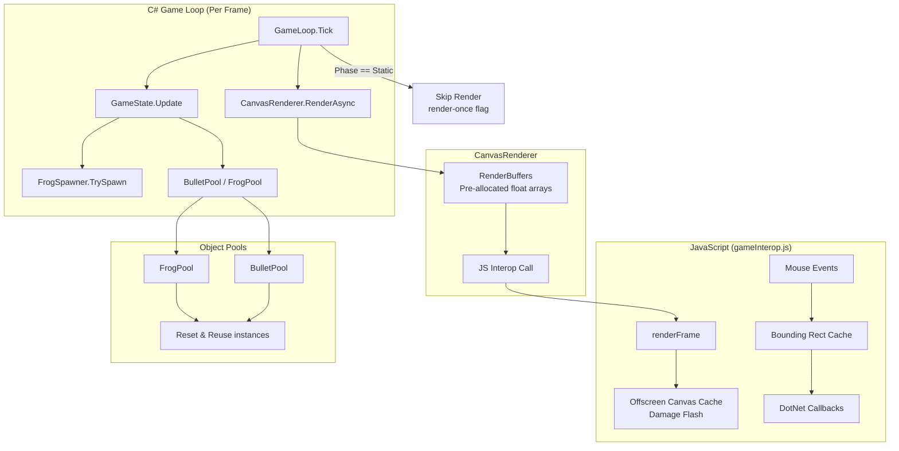

# Design Document: Performance Optimizations

## Overview

This design addresses six targeted performance optimizations for the Frogmageddon Blazor WebAssembly game. The primary goals are:

1. **Eliminate per-frame heap allocations** in the hot rendering path (C# → JS interop)
2. **Cache expensive browser APIs** (getBoundingClientRect, offscreen canvas creation)
3. **Reduce redundant work** (static screen re-rendering every frame)
4. **Pool short-lived game objects** (bullets and frogs) to avoid GC pressure spikes

All optimizations preserve identical gameplay behavior—collision detection, scoring, physics, spawn timing, and visual output remain unchanged. The changes are internal and invisible to the player except through improved frame consistency.

### Design Rationale

Blazor WebAssembly runs on a single-threaded runtime where GC pauses directly stall the game loop. Each optimization targets a specific allocation hotspot or redundant operation identified through frame profiling:

| Optimization | Root Cause | Impact |
|---|---|---|
| Pre-allocated buffers | `new float[]` every frame in RenderAsync | ~2 arrays/frame (variable size) |
| Offscreen canvas cache | `document.createElement('canvas')` on damage flash | 1 DOM element per flash frame |
| Bounding rect cache | `getBoundingClientRect()` on every mouse event | Layout recalc per event |
| Static empty list | `new List<Frog>()` on non-spawn frames | 1 list alloc/frame (~95% of frames) |
| Static screen render-once | Full JS interop call on static phases | 1 wasted interop call/frame |
| Object pooling | `new Bullet()` / `new Frog()` on spawn/fire | 2-7 objects per spawn event |

## Architecture



### Key Design Decisions

1. **Grow-only buffers** — Buffers grow to accommodate peak entity count but never shrink. This avoids pathological grow/shrink oscillation and keeps peak-frame allocation at zero after warmup.

2. **`ArraySegment<float>` or slice length parameter** — We pass only the filled portion of the buffer to JS interop by passing an explicit `count` parameter rather than slicing the array. This avoids creating a new array copy.

3. **Static readonly empty list** — `FrogSpawner` returns a shared `IReadOnlyList<Frog>` instance for no-spawn frames. The caller (`GameState`) already checks `.Count > 0` before calling `AddRange`, so no behavior change is needed.

4. **Render-once via phase-transition flag** — A `_lastRenderedPhase` field in `GameLoop` tracks whether the current static screen has already been rendered. Only phase transitions trigger a render call.

5. **Generic `ObjectPool<T>`** — A single reusable pool class serves both bullets and frogs. It uses a simple `Stack<T>` internally with no maximum capacity. Objects implement a `Reset()` method for reinitialization.

## Components and Interfaces

### 1. RenderBuffer (new internal class)

```csharp
namespace BlazorAsteroids.Game.Engine;

/// <summary>
/// A grow-only float buffer that avoids per-frame allocations.
/// </summary>
internal sealed class RenderBuffer
{
    private float[] _data;

    public RenderBuffer(int initialCapacity)
    {
        _data = new float[initialCapacity];
    }

    public float[] Data => _data;

    /// <summary>
    /// Ensures capacity is at least <paramref name="required"/> elements.
    /// Grows by doubling if needed. Never shrinks.
    /// </summary>
    public void EnsureCapacity(int required)
    {
        if (_data.Length >= required) return;
        int newSize = _data.Length;
        while (newSize < required) newSize *= 2;
        _data = new float[newSize];
    }
}
```

### 2. ObjectPool\<T\> (new generic class)

```csharp
namespace BlazorAsteroids.Game.Models;

/// <summary>
/// A simple object pool with no maximum capacity.
/// </summary>
public sealed class ObjectPool<T> where T : class, new()
{
    private readonly Stack<T> _pool = new();

    public T Acquire()
    {
        return _pool.Count > 0 ? _pool.Pop() : new T();
    }

    public void Release(T instance)
    {
        _pool.Push(instance);
    }

    public int Count => _pool.Count;
}
```

### 3. IPoolable Interface

```csharp
namespace BlazorAsteroids.Game.Models;

/// <summary>
/// Implemented by objects that can be reset for reuse from an object pool.
/// </summary>
public interface IPoolable
{
    void Reset();
}
```

### 4. Modified CanvasRenderer

Key changes:
- Two `RenderBuffer` fields: `_frogBuffer` and `_bulletBuffer` (initialized in constructor)
- `RenderAsync` calls `EnsureCapacity`, populates existing array, passes array + count to JS
- No `new float[]` in the render path

### 5. Modified gameInterop.js

Key changes:
- Module-level `_cachedRect` variable and `_offscreenCanvas` / `_offscreenCtx` variables
- `initializeGame` computes and stores `_cachedRect`
- Window resize listener invalidates `_cachedRect`
- Mouse event handlers use `_cachedRect` instead of calling `getBoundingClientRect()`
- `drawPlayerSprite` reuses `_offscreenCanvas` instead of `document.createElement('canvas')`

### 6. Modified GameLoop

Key changes:
- New field: `GamePhase? _lastRenderedPhase`
- On entering StartScreen/GameOver/Paused: render once, set `_lastRenderedPhase`
- On subsequent ticks in same phase: skip render call, only process input

### 7. Modified FrogSpawner

Key changes:
- Static readonly field: `private static readonly IReadOnlyList<Frog> EmptyFrogList = Array.Empty<Frog>();`
- Return type changes from `List<Frog>` to `IReadOnlyList<Frog>`
- No-spawn paths return `EmptyFrogList`
- Spawn path still returns `new List<Frog>(groupSize)` containing the new frogs

### 8. Modified GameState

Key changes:
- `ObjectPool<Bullet> BulletPool` and `ObjectPool<Frog> FrogPool` fields
- `FireBullet` acquires from pool, calls `bullet.Initialize(position, direction)`
- `FrogSpawner` (or `GameState`) acquires frogs from pool, calls `frog.Initialize(position, rotation)`
- Dead entity removal returns instances to pool instead of discarding them

### 9. Modified Bullet and Frog classes

Key changes:
- Add parameterless constructor (required for pool `new T()`)
- Add `Initialize(...)` method that sets all fields to the provided values
- Existing constructor delegates to `Initialize` for backward compatibility during transition

## Data Models

### RenderBuffer State

| Field | Type | Description |
|---|---|---|
| `_data` | `float[]` | The backing array. Grows by 2× when capacity is exceeded. |

### ObjectPool\<T\> State

| Field | Type | Description |
|---|---|---|
| `_pool` | `Stack<T>` | LIFO stack of available instances. |

### Bullet (additions for pooling)

| Member | Type | Description |
|---|---|---|
| `Bullet()` | constructor | Parameterless; creates uninitialized instance for pool. |
| `Initialize(Vector2 start, Vector2 dir)` | method | Sets Position, Direction, resets Lifetime and IsAlive. |

### Frog (additions for pooling)

| Member | Type | Description |
|---|---|---|
| `Frog()` | constructor | Parameterless; creates uninitialized instance for pool. |
| `Initialize(Vector2 pos, float rotation)` | method | Sets Position, Rotation, resets IsAlive, state timers. |

### GameLoop (additions for render-once)

| Field | Type | Description |
|---|---|---|
| `_lastRenderedPhase` | `GamePhase?` | Tracks which static screen was last rendered. Set to `null` on transition to Playing. |

### JavaScript Module State (gameInterop.js)

| Variable | Type | Description |
|---|---|---|
| `_cachedRect` | `DOMRect \| null` | Cached result of `getBoundingClientRect()`. Invalidated on resize. |
| `_offscreenCanvas` | `HTMLCanvasElement` | Persistent offscreen canvas for damage flash compositing. |
| `_offscreenCtx` | `CanvasRenderingContext2D` | Cached 2D context of the offscreen canvas. |


## Correctness Properties

*A property is a characteristic or behavior that should hold true across all valid executions of a system—essentially, a formal statement about what the system should do. Properties serve as the bridge between human-readable specifications and machine-verifiable correctness guarantees.*

### Property 1: Buffer capacity is monotonically non-decreasing and always sufficient

*For any* sequence of required capacities passed to `RenderBuffer.EnsureCapacity`, the buffer's `Data.Length` SHALL be monotonically non-decreasing AND always ≥ the most recent required capacity.

**Validates: Requirements 1.2, 1.3**

### Property 2: Buffer identity is preserved when capacity is sufficient

*For any* call to `RenderBuffer.EnsureCapacity` where the required capacity is ≤ the current `Data.Length`, the array reference returned by `Data` SHALL be the same object as before the call (no reallocation).

**Validates: Requirements 1.1, 1.5**

### Property 3: Render data count matches entity count

*For any* game state with N frogs and M bullets, when `RenderAsync` is called, the effective data length passed to JavaScript SHALL equal N × 5 for frog data and M × 3 for bullet data.

**Validates: Requirements 1.4**

### Property 4: Offscreen canvas dimensions are always sufficient

*For any* sequence of player sizes passed to `drawPlayerSprite` with `isFlashing=true`, the cached offscreen canvas dimensions SHALL be ≥ the required dimensions (2 × size, scaled by aspect ratio) after each call.

**Validates: Requirements 2.3**

### Property 5: Cached bounding rect produces identical coordinates

*For any* clientX and clientY mouse event coordinates, the canvas-relative position computed using the cached bounding rectangle SHALL equal the position computed by calling `getBoundingClientRect()` directly (assuming no resize occurred between cache and use).

**Validates: Requirements 3.4**

### Property 6: FrogSpawner returns static empty instance if and only if no frogs are spawned

*For any* call to `TrySpawn`, if the result contains zero frogs then the returned reference SHALL be the shared static empty list; if the result contains one or more frogs then the returned reference SHALL NOT be the shared static empty list.

**Validates: Requirements 4.1, 4.3**

### Property 7: Static screen render count stays at one regardless of tick count

*For any* number of ticks N (N ≥ 1) occurring while the game remains in the same static phase (StartScreen, GameOver, or Paused) without a phase change, the render function for that screen SHALL be invoked exactly once (on the initial transition) and zero additional times during subsequent ticks.

**Validates: Requirements 5.2, 5.3**

### Property 8: Pool acquire-release round-trip preserves count

*For any* count N of objects released into an `ObjectPool<T>`, the pool's `Count` SHALL equal N. Subsequently acquiring N objects SHALL reduce the pool's `Count` to zero, and each acquired object SHALL be non-null.

**Validates: Requirements 6.5, 6.6**

### Property 9: Pooled bullet initialization preserves fire parameters

*For any* start position and direction vector, a bullet acquired from the pool and initialized with those parameters SHALL have `Position` equal to the start position, `Direction` equal to the normalized direction, `IsAlive` equal to true, and `Lifetime` equal to zero.

**Validates: Requirements 6.2**

### Property 10: Pooled frog initialization preserves spawn parameters

*For any* spawn position and rotation value, a frog acquired from the pool and initialized with those parameters SHALL have `Position` equal to the spawn position, `Rotation` equal to the given rotation, `IsAlive` equal to true, and be in the Sitting state.

**Validates: Requirements 6.3**

### Property 11: Dead entities are returned to pool after cleanup

*For any* set of active bullets and frogs where a subset K are marked `IsAlive = false`, after the cleanup step the pool count SHALL increase by |K| and the active list count SHALL decrease by |K|.

**Validates: Requirements 6.4**

## Error Handling

| Scenario | Handling Strategy |
|---|---|
| `EnsureCapacity` called with 0 or negative | No-op (buffer already satisfies `length >= 0`) |
| `ObjectPool.Acquire` when pool is empty | Allocate a new instance via `new T()` — never fails for simple game objects |
| `ObjectPool.Release` with null | Guard clause: ignore null releases (defensive) |
| JS offscreen canvas context fails | Fall back to rendering without flash overlay (graceful degradation) |
| Window resize fires before canvas is attached | `_cachedRect` stays null; mouse handlers fall back to `getBoundingClientRect()` until cache is populated |
| `RenderAsync` called before `InitializeAsync` | Existing null check on `_module` already short-circuits — no change needed |

No new exception types or error codes are introduced. All error handling is defensive and invisible to the player.

## Testing Strategy

### Property-Based Tests (C# — using FsCheck via FsCheck.Xunit)

Property-based testing is well-suited for this feature because the optimizations involve **pure data structure invariants** (buffer growth, pool round-trips, render counts) that must hold across all possible input sequences.

**Configuration:**
- Minimum 100 iterations per property test
- Each test tagged with: `Feature: performance-optimizations, Property {N}: {description}`

**Properties to implement:**
1. Buffer monotonic growth (Property 1)
2. Buffer identity preservation (Property 2)
3. Render data count correctness (Property 3)
4. FrogSpawner empty list identity (Property 6)
5. Static screen render-once invariant (Property 7)
6. Pool acquire-release round-trip (Property 8)
7. Bullet initialization correctness (Property 9)
8. Frog initialization correctness (Property 10)
9. Dead entity pool return (Property 11)

### JavaScript Unit Tests (using Vitest or Jest)

- **Property 4** (offscreen canvas dimensions): Generate random player sizes, verify canvas dimensions after each call
- **Property 5** (bounding rect equivalence): Generate random mouse coordinates, compare cached vs direct computation
- Smoke test: offscreen canvas exists after init (Requirement 2.1)
- Smoke test: `_cachedRect` is populated after init (Requirement 3.1)
- Example test: resize invalidates cache (Requirement 3.3)

### Integration Tests

- Behavioral equivalence (Requirement 6.7): Run a deterministic 60-frame game sequence with a seeded Random, compare all state values with and without pooling
- Visual regression (Requirement 2.4): Manual verification that damage flash looks identical
- Spawn equivalence (Requirement 4.4): Seeded comparison of spawn outputs before/after optimization

### Unit Tests (Example-Based)

- FrogSpawner: returned empty list is genuinely read-only (Requirement 4.2)
- GameLoop: render called exactly once on transition, then not again (Requirements 5.1, 5.4)
- ObjectPool: Acquire from empty pool returns valid instance (Requirement 6.5)
- GameState pools are non-null after construction (Requirement 6.1)
