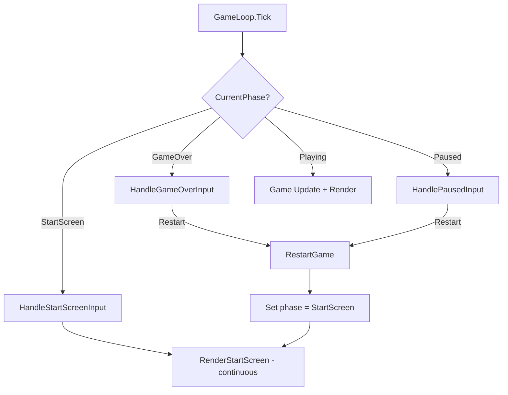

# Design Document: Restart to Start Screen & Frog Sprite Display Fix

## Overview

This design addresses two bugs in the Frogmageddon game loop:

1. **Restart navigates to start screen** — The `RestartGame()` method currently transitions directly to `GamePhase.Playing`. It should instead transition to `GamePhase.StartScreen`, giving the player the standard start experience (title, start button, instructions access).

2. **Frog sprite displays on start screen** — The start screen uses a render-once pattern (`_lastRenderedPhase` check) but frog sprites load asynchronously. The initial render fires before sprites are ready, and no re-render ever occurs. The fix removes the render-once optimization for the start screen phase so it continuously re-renders until the player navigates away.

## Architecture



## Components and Interfaces

### Component 1: GameLoop.RestartGame()

**Current behavior**: Resets all game state, sets `_currentPhase = GamePhase.Playing`.

**New behavior**: Resets all game state, sets `_currentPhase = GamePhase.StartScreen` and `_lastRenderedPhase = null`.

```csharp
private void RestartGame()
{
    // Reset player state
    _gameState.Player.Health = 100;
    _gameState.Player.Score = 0;
    _gameState.Player.DamageFlashTimer = 0f;
    _gameState.Player.InvincibilityTimer = 0f;
    _gameState.Player.Position = new Vector2(
        _gameState.WorldWidth / 2f,
        _gameState.WorldHeight / 2f);

    // Return all entities to pools before clearing
    foreach (var bullet in _gameState.Bullets)
    {
        bullet.Reset();
        _gameState.BulletPool.Release(bullet);
    }
    foreach (var frog in _gameState.Frogs)
    {
        frog.Reset();
        _gameState.FrogPool.Release(frog);
    }
    _gameState.Frogs.Clear();
    _gameState.Bullets.Clear();

    _gameState.Camera.SnapTo(_gameState.Player.Position);
    _gameState.AmmoSystem.Reset();
    _gameState.StaminaSystem.Reset();
    _gameState.PlayerAnimation.Reset();

    // Navigate to start screen instead of playing directly
    _lastRenderedPhase = null;
    _currentPhase = GamePhase.StartScreen;
}
```

### Component 2: GameLoop.Tick() — Start Screen Phase

**Current behavior**: Renders start screen only when `_lastRenderedPhase != _currentPhase` (render-once).

**New behavior**: Always renders the start screen every tick (no render-once gate). This ensures:
- Frog sprite appears as soon as it finishes async loading
- No timing dependency between sprite load and first render

```csharp
if (_currentPhase == GamePhase.StartScreen)
{
    HandleStartScreenInput();
    if (_currentPhase == GamePhase.StartScreen)
    {
        // Continuously render — frog sprites load asynchronously
        _ = _renderer.RenderStartScreenAsync(
            _gameState.CanvasWidth, _gameState.CanvasHeight, _buttonBounds);
        _lastRenderedPhase = _currentPhase;
    }
}
```

### Component 3: drawStartScreen (JavaScript)

**No changes needed.** The existing `drawStartScreen` function already handles both cases:
- When `frogSpritesLoaded` is false: draws title and buttons without frog image
- When `frogSpritesLoaded` is true: draws frog image above title

The fix is purely on the C# side — by calling `drawStartScreen` every frame, it will naturally pick up the loaded sprites once they become available.

## Data Models

No data model changes. The existing `GamePhase` enum already contains `StartScreen`:

```csharp
public enum GamePhase
{
    StartScreen,
    Instructions,
    Playing,
    Paused,
    GameOver
}
```

## Key Functions with Formal Specifications

### Function: RestartGame()

```csharp
private void RestartGame()
```

**Preconditions:**
- `_currentPhase` is `GamePhase.GameOver` or `GamePhase.Paused`
- `_gameState` is non-null and initialized

**Postconditions:**
- `_currentPhase == GamePhase.StartScreen`
- `_lastRenderedPhase == null`
- `_gameState.Player.Health == 100`
- `_gameState.Player.Score == 0`
- `_gameState.Frogs.Count == 0`
- `_gameState.Bullets.Count == 0`
- All returned entities are released to their respective pools

### Function: Tick() — Start Screen Branch

```csharp
public void Tick(float deltaTimeMs)  // StartScreen branch
```

**Preconditions:**
- `_currentPhase == GamePhase.StartScreen`
- `_isRunning == true`
- `deltaTimeMs >= 0`

**Postconditions:**
- `RenderStartScreenAsync` is called every tick (no render-once gate)
- `_lastRenderedPhase == GamePhase.StartScreen` after render
- If start button clicked or Enter pressed: transitions to `GamePhase.Playing`
- If instructions button clicked: transitions to `GamePhase.Instructions`

## Example Usage

### Scenario 1: Player dies and restarts

```csharp
// Player health reaches 0 during gameplay
// → _currentPhase = GamePhase.GameOver

// Player clicks restart button on game-over screen
// → HandleGameOverInput() calls RestartGame()
// → _currentPhase = GamePhase.StartScreen
// → Next Tick: start screen renders with title, frog, and buttons
// → Player clicks "Start" button
// → TransitionToPlaying() sets _currentPhase = GamePhase.Playing
```

### Scenario 2: Player pauses and restarts

```csharp
// Player presses Escape during gameplay
// → _currentPhase = GamePhase.Paused

// Player clicks restart button on pause screen
// → HandlePausedInput() calls RestartGame()
// → _currentPhase = GamePhase.StartScreen
// → Next Tick: start screen renders continuously
```

### Scenario 3: Frog sprite loads after initial render

```csharp
// Game starts, first Tick fires
// → frogSpritesLoaded is still false in JS
// → drawStartScreen renders without frog image
// → Next Tick: drawStartScreen called again (continuous render)
// → frogSpritesLoaded becomes true (async load completes)
// → drawStartScreen now draws frog image above title
```

## Error Handling

### Edge Case: Rapid restart clicks

**Condition**: Player double-clicks restart very quickly
**Response**: The state reset in `RestartGame()` is idempotent — calling it multiple times just resets to the same clean state. No harm from repeated calls since all entity lists are cleared and pools are released.

### Edge Case: Sprite load failure

**Condition**: Frog sprite fails to load (network error or timeout)
**Response**: The `drawStartScreen` JS function already guards with `if (frogSpritesLoaded && frogSprites[0])`. If sprites never load, the start screen simply renders without the frog image. The game remains fully playable.

## Correctness Properties

*A property is a characteristic or behavior that should hold true across all valid executions of a system — essentially, a formal statement about what the system should do. Properties serve as the bridge between human-readable specifications and machine-verifiable correctness guarantees.*

### Property 1: RestartGame always navigates to StartScreen

For any game state where `RestartGame()` is called (from GameOver or Paused phase), the resulting `_currentPhase` SHALL be `GamePhase.StartScreen` and `_lastRenderedPhase` SHALL be `null`.

**Validates: Requirements 1.1, 1.2**

### Property 2: Start screen renders every tick

For any tick where `_currentPhase == GamePhase.StartScreen` and `_isRunning == true`, `RenderStartScreenAsync` SHALL be invoked (no render-once gating).

**Validates: Requirements 2.1, 2.2**

### Property 3: RestartGame resets all game state

For any call to `RestartGame()`, the player health SHALL be 100, score SHALL be 0, frogs list SHALL be empty, and bullets list SHALL be empty after the call completes.

**Validates: Requirements 1.3, 1.4**

### Property 4: RestartGame is idempotent

For any game state, calling `RestartGame()` N times (N ≥ 1) produces the same resulting state as calling it once.

**Validates: Requirements 1.1, 1.2, 1.3, 1.4**
