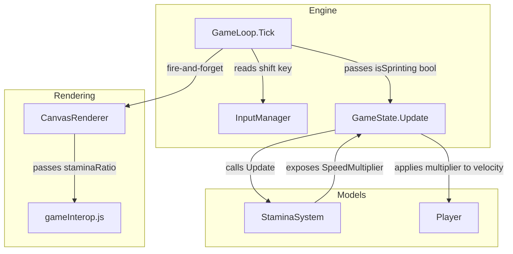
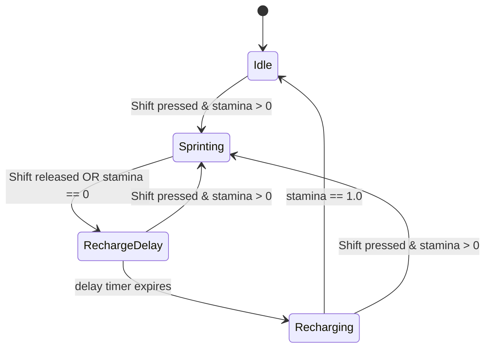

# Design Document: Sprint Stamina

## Overview

This design adds a sprint mechanic to Frogmageddon. The player holds Shift to move at 1.3× base speed, consuming a stamina resource that recharges after a cooldown. The feature follows the same architectural patterns established by the existing `AmmoSystem` — a self-contained model class with an `Update(deltaTime)` method, integrated into the game loop through `GameState`.

### Key Design Decisions

1. **Dedicated `StaminaSystem` class** — mirrors the `AmmoSystem` pattern for consistency and testability. Pure logic, no rendering concerns.
2. **State-machine approach** — the stamina system uses an enum (`StaminaState`) to track whether the player is Idle, Sprinting, in RechargeDelay, or Recharging. This makes transitions explicit and testable.
3. **Speed multiplier returned by `StaminaSystem`** — rather than modifying the player directly, `StaminaSystem` exposes a `SpeedMultiplier` property that `GameState.Update` reads when computing velocity. This keeps the sprint logic decoupled from movement.
4. **Input handled in `GameLoop.Tick`** — the game loop queries `IsKeyPressed("shift")` and passes the sprint-intent boolean into the stamina system update, matching how reload input is handled.

## Architecture



### State Machine



## Components and Interfaces

### StaminaSystem (new class)

| Member | Type | Description |
|--------|------|-------------|
| `Stamina` | `float` (property) | Current stamina, clamped [0.0, 1.0] |
| `State` | `StaminaState` (property) | Current state enum value |
| `SpeedMultiplier` | `float` (property, read-only) | Returns 1.3 if sprinting, else 1.0 |
| `IsSprinting` | `bool` (property, read-only) | Whether sprint is currently active |
| `Update(float deltaTime, bool shiftPressed)` | `void` | Advances the state machine one frame |
| `Reset()` | `void` | Resets to full stamina, Idle state |

**Constants:**

| Constant | Value | Purpose |
|----------|-------|---------|
| `SprintMultiplier` | 1.3f | Speed multiplier during sprint |
| `DepletionRate` | 0.2f | Stamina consumed per second while sprinting |
| `RechargeRate` | 0.0667f | Stamina recovered per second while recharging |
| `RechargeDelayDuration` | 2.0f | Seconds before recharge begins after sprint ends |

### StaminaState (new enum)

```csharp
public enum StaminaState
{
    Idle,           // Full stamina, not sprinting
    Sprinting,      // Active sprint, depleting stamina
    RechargeDelay,  // Cooldown period after sprint ends
    Recharging      // Stamina actively recovering
}
```

### InputManager (modified)

- Add `"shift"` to the `ValidKeys` set.
- No other changes needed — the existing `SetKeyDown`/`SetKeyUp` with `ToLowerInvariant()` already handles left/right Shift since browsers emit `"Shift"` for both.

### GameState (modified)

- Add `StaminaSystem` property (same pattern as `AmmoSystem`).
- In `Update()`, apply `StaminaSystem.SpeedMultiplier` to the velocity calculation alongside the backpedal multiplier.

### GameLoop (modified)

- In the `Playing` phase of `Tick()`, query `_inputManager.IsKeyPressed("shift")` and pass the result to `_gameState.StaminaSystem.Update(deltaTimeSec, shiftPressed)`.
- In `RestartGame()`, call `_gameState.StaminaSystem.Reset()`.

### CanvasRenderer (modified)

- Pass `_gameState.StaminaSystem.Stamina` (clamped 0–1) to the JS `renderFrame` call as an additional parameter.

### JavaScript renderFrame (modified)

- Accept the stamina ratio parameter.
- Draw a 200×12px bar below the health display. Background: dark gray. Fill: green scaled by ratio.

## Data Models

### StaminaSystem Properties

```csharp
public class StaminaSystem
{
    public const float SprintMultiplier = 1.3f;
    public const float DepletionRate = 0.2f;       // per second
    public const float RechargeRate = 0.0667f;     // per second
    public const float RechargeDelayDuration = 2.0f; // seconds

    public float Stamina { get; private set; } = 1.0f;
    public StaminaState State { get; private set; } = StaminaState.Idle;
    public float RechargeDelayTimer { get; private set; } = 0f;

    public bool IsSprinting => State == StaminaState.Sprinting;
    public float SpeedMultiplier => IsSprinting ? SprintMultiplier : 1.0f;
}
```

### Player (unchanged)

The Player class does not gain stamina-related fields. Stamina is owned entirely by `StaminaSystem` to maintain single responsibility, matching how ammo is owned by `AmmoSystem` rather than `Player`.

### GameState Addition

```csharp
public StaminaSystem StaminaSystem { get; set; } = new();
```


## Correctness Properties

*A property is a characteristic or behavior that should hold true across all valid executions of a system — essentially, a formal statement about what the system should do. Properties serve as the bridge between human-readable specifications and machine-verifiable correctness guarantees.*

### Property 1: Shift Key Press/Release Round-Trip

*For any* case variation of the string "shift" (e.g., "Shift", "SHIFT", "sHiFt"), calling `SetKeyDown` with that string followed by `SetKeyUp` with the same string SHALL result in `IsKeyPressed("shift")` returning false, and calling `SetKeyDown` alone SHALL result in `IsKeyPressed("shift")` returning true.

**Validates: Requirements 1.2, 1.3**

### Property 2: Speed Multiplier Correctness

*For any* state of the `StaminaSystem`, the `SpeedMultiplier` property SHALL return 1.3 if and only if `IsSprinting` is true; otherwise it SHALL return 1.0.

**Validates: Requirements 2.1, 2.2, 2.3, 2.4**

### Property 3: Stamina Bounds Invariant

*For any* sequence of `Update(deltaTime, shiftPressed)` calls with non-negative `deltaTime` values and arbitrary `shiftPressed` booleans, the `Stamina` property SHALL remain within the closed interval [0.0, 1.0] after every call.

**Validates: Requirements 3.1, 3.4**

### Property 4: Depletion Rate During Sprint

*For any* `StaminaSystem` in the `Sprinting` state with stamina value `s > 0`, after a single `Update(dt, true)` call where `dt > 0`, the resulting stamina SHALL equal `max(0, s - 0.2 * dt)`.

**Validates: Requirements 3.2, 5.3**

### Property 5: Sprint End Triggers Recharge Delay

*For any* `StaminaSystem` in the `Sprinting` state with stamina `s` where `0 < s < 1.0`, when `Update(dt, false)` is called (shift released), the system SHALL transition to `RechargeDelay` state with `RechargeDelayTimer` equal to 2.0. Similarly, for any `StaminaSystem` in the `Sprinting` state where an `Update(dt, true)` call causes stamina to reach 0.0, the system SHALL transition to `RechargeDelay` with timer equal to 2.0.

**Validates: Requirements 4.1, 4.2**

### Property 6: Stamina Frozen During Recharge Delay

*For any* `StaminaSystem` in the `RechargeDelay` state with stamina value `s` and timer `t > 0`, calling `Update(dt, false)` where `dt < t` SHALL leave stamina at exactly `s` (unchanged).

**Validates: Requirements 4.3**

### Property 7: Recharge Delay Timer Expiry Transitions to Recharging

*For any* `StaminaSystem` in the `RechargeDelay` state with timer `t > 0`, calling `Update(dt, false)` where `dt >= t` SHALL result in the system transitioning to the `Recharging` state.

**Validates: Requirements 4.4**

### Property 8: Shift During Recharge Delay Resumes Sprint

*For any* `StaminaSystem` in the `RechargeDelay` state with stamina `s > 0`, calling `Update(dt, true)` SHALL transition the system to the `Sprinting` state.

**Validates: Requirements 4.5**

### Property 9: Recharge Rate When Recharging

*For any* `StaminaSystem` in the `Recharging` state with stamina value `s < 1.0`, after a single `Update(dt, false)` call where `s + 0.0667 * dt <= 1.0`, the resulting stamina SHALL equal `s + 0.0667 * dt`.

**Validates: Requirements 5.1**

### Property 10: Transition from Recharging to Sprinting Preserves Stamina

*For any* `StaminaSystem` in the `Recharging` state with stamina value `s > 0`, calling `Update(dt, true)` SHALL transition to `Sprinting` state with stamina still equal to `s` (no recharge is applied on the transition frame).

**Validates: Requirements 5.4**

### Property 11: Reset Postconditions

*For any* `StaminaSystem` in any state (any stamina value, any timer value, any active state), calling `Reset()` SHALL result in `Stamina == 1.0`, `State == Idle`, `RechargeDelayTimer == 0`, and `IsSprinting == false`.

**Validates: Requirements 7.1, 7.2, 7.3**

## Error Handling

| Scenario | Handling |
|----------|----------|
| Negative deltaTime passed to Update | Treat as 0 (no-op). `GameLoop` already clamps negative deltas, but `StaminaSystem` should be defensive. |
| Very large deltaTime (tab backgrounded) | `GameLoop` caps at 0.1s. `StaminaSystem` handles any positive delta correctly via clamping. |
| Stamina arithmetic underflow/overflow | Clamped to [0.0, 1.0] after every depletion/recharge calculation. |
| Shift key never registered in ValidKeys | Compile-time constant — if missing, `IsKeyPressed("shift")` always returns false, sprint never activates. Covered by unit test. |
| StaminaSystem.Update called when not in Playing phase | Should not happen — `GameLoop` only calls during Playing phase. No guard needed in StaminaSystem. |

## Testing Strategy

### Unit Tests (Example-Based)

- **InputManager**: Verify "shift" is in ValidKeys; verify both "Shift" and "shift" register correctly.
- **Stamina Bar rendering**: Verify JS receives clamped value; verify fill width = 200 × ratio for boundary values (0.0, 0.5, 1.0).
- **GameState integration**: Verify velocity calculation correctly applies StaminaSystem.SpeedMultiplier alongside backpedal multiplier.
- **GameLoop RestartGame**: Verify StaminaSystem.Reset() is called on game restart.

### Property-Based Tests

**Library**: [FsCheck](https://fscheck.github.io/FsCheck/) for .NET (integrates with xUnit).

**Configuration**: Minimum 100 iterations per property test.

**Tag format**: `Feature: sprint-stamina, Property {number}: {property_text}`

Each of the 11 correctness properties above will be implemented as a single property-based test with generated inputs:

| Property | Generator Strategy |
|----------|-------------------|
| 1 (Shift round-trip) | Random case variations of "shift" string |
| 2 (SpeedMultiplier) | Random StaminaSystem states |
| 3 (Bounds invariant) | Random sequences of (deltaTime, shiftPressed) pairs |
| 4 (Depletion rate) | Random deltaTime ∈ (0, 0.1], random starting stamina ∈ (0, 1] |
| 5 (Sprint end) | Random stamina ∈ (0, 1), random deltaTime |
| 6 (Frozen during delay) | Random stamina, random timer > dt |
| 7 (Timer expiry) | Random timer, deltaTime ≥ timer |
| 8 (Shift resumes sprint) | Random stamina > 0, random timer, shift=true |
| 9 (Recharge rate) | Random deltaTime, random starting stamina where result ≤ 1.0 |
| 10 (Recharge→Sprint preserves) | Random stamina > 0 in Recharging state |
| 11 (Reset postconditions) | Random pre-reset states (any field values) |

### Integration Tests

- End-to-end: Hold shift for N frames, verify player position advanced further than without shift.
- Verify stamina bar appears in rendered output when stamina < 1.0.
- Verify game restart resets stamina bar to full.
