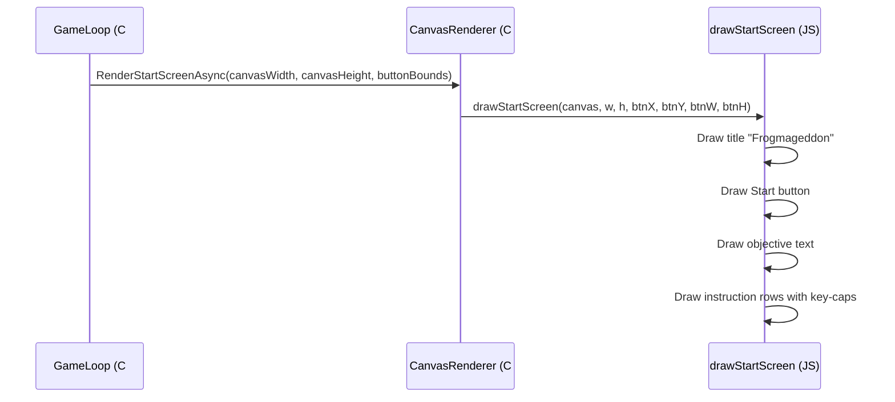

# Design Document: Start Screen Instructions

## Overview

Add a visually styled instructions section to the start screen below the Start button. The instructions use key-cap style boxes (rounded rectangles with key labels) paired with action descriptions, ordered logically for a new player learning the game. The layout is vertically centered as a group (title + button + instructions) so everything fits cleanly on an 800×600 canvas.

## Main Algorithm/Workflow



## Core Interfaces/Types

```javascript
// Instruction entry definition (used internally in drawStartScreen)
// Each entry has key label(s) and an action description
const instructions = [
    { keys: ["W", "A", "S", "D"], label: "Move", isWASD: true },
    { keys: ["Mouse", "Click"], label: "Shoot", isMouse: true },
    { keys: ["R"], label: "Reload" },
    { keys: ["Shift"], label: "Sprint" },
    { keys: ["Esc"], label: "Pause" }
];
```

## Key Functions with Formal Specifications

### Function 1: drawStartScreen() — updated

```javascript
export function drawStartScreen(canvasElement, canvasWidth, canvasHeight, btnX, btnY, btnW, btnH)
```

**Preconditions:**
- `canvasElement` is a valid HTMLCanvasElement with a 2D context
- `canvasWidth` and `canvasHeight` are positive integers (typically 800×600)
- `btnX`, `btnY`, `btnW`, `btnH` define valid button bounds within the canvas

**Postconditions:**
- Canvas is cleared and redrawn with title, button, objective text, and instructions
- Title is rendered above the button
- Start button is rendered at the provided coordinates
- Objective text ("Get rid of the frogs invading the office!") appears below the button
- Instruction rows with key-cap visuals appear below the objective text
- All elements are horizontally centered
- The entire layout fits within the 800×600 canvas without clipping

**Signature change:** None — the existing function signature is unchanged. The instructions are rendered purely within the JS function using the canvas dimensions already passed.

### Function 2: drawKeyCap() — new helper

```javascript
function drawKeyCap(ctx, x, y, label, width, height)
```

**Preconditions:**
- `ctx` is a valid CanvasRenderingContext2D
- `x`, `y` define the top-left corner of the key-cap
- `label` is a non-empty string (the key text)
- `width` > 0, `height` > 0

**Postconditions:**
- Draws a rounded rectangle (radius 5px) with dark fill (#2a2a2a) and light border (#888888)
- Renders `label` centered inside the rectangle in white monospace font
- Does not modify canvas state outside of its drawing area (uses save/restore)

### Function 3: drawWASDCluster() — new helper

```javascript
function drawWASDCluster(ctx, centerX, y, keySize)
```

**Preconditions:**
- `ctx` is a valid CanvasRenderingContext2D
- `centerX` is the horizontal center position for the cluster
- `y` is the top Y position for the cluster
- `keySize` > 0

**Postconditions:**
- Draws 4 key-caps in a cross/arrow-key layout: W on top, A-S-D on the bottom row
- The cluster is centered horizontally around `centerX`
- Total cluster height = 2 * keySize + gap

## Algorithmic Pseudocode

### Start Screen Layout Algorithm

```javascript
// Layout constants
const TITLE_FONT_SIZE = 48;
const BUTTON_HEIGHT = 50;
const OBJECTIVE_FONT_SIZE = 16;
const KEYCAP_SIZE = 30;          // Standard key-cap square
const KEYCAP_WIDE = 50;          // Wide keys (Shift, Esc)
const INSTRUCTION_ROW_HEIGHT = 40;
const SECTION_GAP = 20;

// Calculate total content height to vertically center everything
function calculateLayout(canvasWidth, canvasHeight) {
    const titleHeight = TITLE_FONT_SIZE;
    const buttonSection = BUTTON_HEIGHT;
    const objectiveHeight = OBJECTIVE_FONT_SIZE + 10;
    const instructionsHeight = 5 * INSTRUCTION_ROW_HEIGHT; // 5 control rows
    // WASD row is taller due to 2-row cluster
    const wasdExtraHeight = KEYCAP_SIZE + 4; // extra row for W key above ASD

    const totalHeight = titleHeight + SECTION_GAP
        + buttonSection + SECTION_GAP
        + objectiveHeight + SECTION_GAP
        + instructionsHeight + wasdExtraHeight;

    const startY = (canvasHeight - totalHeight) / 2;

    return { startY, totalHeight };
}
```

### Key-Cap Rendering Algorithm

```javascript
function drawKeyCap(ctx, x, y, label, width, height) {
    const radius = 5;

    ctx.save();

    // Draw rounded rectangle background
    ctx.beginPath();
    ctx.roundRect(x, y, width, height, radius);
    ctx.fillStyle = '#2a2a2a';
    ctx.fill();

    // Draw border
    ctx.strokeStyle = '#888888';
    ctx.lineWidth = 1.5;
    ctx.stroke();

    // Draw subtle inner highlight (top edge)
    ctx.beginPath();
    ctx.roundRect(x + 1, y + 1, width - 2, height - 2, radius - 1);
    ctx.strokeStyle = 'rgba(255, 255, 255, 0.1)';
    ctx.lineWidth = 1;
    ctx.stroke();

    // Draw key label centered
    ctx.fillStyle = '#ffffff';
    ctx.font = 'bold 13px monospace';
    ctx.textAlign = 'center';
    ctx.textBaseline = 'middle';
    ctx.fillText(label, x + width / 2, y + height / 2);

    ctx.restore();
}
```

### WASD Cluster Rendering Algorithm

```javascript
function drawWASDCluster(ctx, centerX, y, keySize) {
    const gap = 4; // gap between keys

    // W key - centered on top row
    drawKeyCap(ctx, centerX - keySize / 2, y, 'W', keySize, keySize);

    // A, S, D keys - bottom row
    const bottomY = y + keySize + gap;
    const totalBottomWidth = 3 * keySize + 2 * gap;
    const startX = centerX - totalBottomWidth / 2;

    drawKeyCap(ctx, startX, bottomY, 'A', keySize, keySize);
    drawKeyCap(ctx, startX + keySize + gap, bottomY, 'S', keySize, keySize);
    drawKeyCap(ctx, startX + 2 * (keySize + gap), bottomY, 'D', keySize, keySize);
}
```

### Full drawStartScreen Algorithm (updated)

```javascript
export function drawStartScreen(canvasElement, canvasWidth, canvasHeight, btnX, btnY, btnW, btnH) {
    const ctx = canvasElement.getContext('2d');
    ctx.clearRect(0, 0, canvasWidth, canvasHeight);

    // --- Recalculate vertical layout to center all content ---
    const SECTION_GAP = 20;
    const KEYCAP_SIZE = 28;
    const KEYCAP_WIDE = 48;
    const ROW_HEIGHT = 38;
    const WASD_EXTRA = KEYCAP_SIZE + 4;

    // Total content height:
    // title (48px) + gap + button (50px) + gap + objective (20px) + gap + instructions
    const titleH = 48;
    const objectiveH = 20;
    const instructionsH = 5 * ROW_HEIGHT + WASD_EXTRA;
    const totalH = titleH + SECTION_GAP + btnH + SECTION_GAP + objectiveH + SECTION_GAP + instructionsH;
    const startY = Math.max(20, (canvasHeight - totalH) / 2);

    // --- Draw Title ---
    let currentY = startY;
    ctx.fillStyle = 'white';
    ctx.font = 'bold 48px monospace';
    ctx.textAlign = 'center';
    ctx.textBaseline = 'middle';
    ctx.fillText('Frogmageddon', canvasWidth / 2, currentY + titleH / 2);
    currentY += titleH + SECTION_GAP;

    // --- Draw Start Button (use recalculated Y for centering) ---
    const adjustedBtnY = currentY;
    ctx.fillStyle = '#333333';
    ctx.fillRect(btnX, adjustedBtnY, btnW, btnH);
    ctx.strokeStyle = 'white';
    ctx.lineWidth = 2;
    ctx.strokeRect(btnX, adjustedBtnY, btnW, btnH);
    ctx.fillStyle = 'white';
    ctx.font = 'bold 24px monospace';
    ctx.fillText('Start', btnX + btnW / 2, adjustedBtnY + btnH / 2);
    currentY += btnH + SECTION_GAP;

    // --- Draw Objective Text ---
    ctx.fillStyle = '#cccccc';
    ctx.font = 'italic 16px monospace';
    ctx.textAlign = 'center';
    ctx.textBaseline = 'top';
    ctx.fillText('Get rid of the frogs invading the office!', canvasWidth / 2, currentY);
    currentY += objectiveH + SECTION_GAP;

    // --- Draw Instructions ---
    const instrX = canvasWidth / 2; // center point for instruction layout
    const labelOffsetX = 80;        // distance from center to action label

    // Row 1: WASD = Move (uses cluster layout)
    drawWASDCluster(ctx, instrX - labelOffsetX, currentY, KEYCAP_SIZE);
    ctx.fillStyle = '#ffffff';
    ctx.font = '15px monospace';
    ctx.textAlign = 'left';
    ctx.textBaseline = 'middle';
    ctx.fillText('Move', instrX + 10, currentY + KEYCAP_SIZE + 2);
    currentY += 2 * KEYCAP_SIZE + 4 + 12; // cluster height + spacing

    // Row 2: Mouse + Click = Shoot
    drawKeyCap(ctx, instrX - labelOffsetX - 10, currentY, 'Mouse', KEYCAP_WIDE, KEYCAP_SIZE);
    ctx.fillStyle = '#aaaaaa';
    ctx.font = '13px monospace';
    ctx.textAlign = 'center';
    ctx.textBaseline = 'middle';
    ctx.fillText('+', instrX - labelOffsetX + KEYCAP_WIDE, currentY + KEYCAP_SIZE / 2);
    drawKeyCap(ctx, instrX - labelOffsetX + KEYCAP_WIDE + 10, currentY, 'Click', KEYCAP_WIDE, KEYCAP_SIZE);
    ctx.fillStyle = '#ffffff';
    ctx.font = '15px monospace';
    ctx.textAlign = 'left';
    ctx.fillText('Shoot', instrX + 10, currentY + KEYCAP_SIZE / 2);
    currentY += ROW_HEIGHT;

    // Row 3: R = Reload
    drawKeyCap(ctx, instrX - labelOffsetX, currentY, 'R', KEYCAP_SIZE, KEYCAP_SIZE);
    ctx.fillStyle = '#ffffff';
    ctx.font = '15px monospace';
    ctx.textAlign = 'left';
    ctx.textBaseline = 'middle';
    ctx.fillText('Reload', instrX + 10, currentY + KEYCAP_SIZE / 2);
    currentY += ROW_HEIGHT;

    // Row 4: Shift = Sprint
    drawKeyCap(ctx, instrX - labelOffsetX, currentY, 'Shift', KEYCAP_WIDE, KEYCAP_SIZE);
    ctx.fillStyle = '#ffffff';
    ctx.font = '15px monospace';
    ctx.textAlign = 'left';
    ctx.textBaseline = 'middle';
    ctx.fillText('Sprint', instrX + 10, currentY + KEYCAP_SIZE / 2);
    currentY += ROW_HEIGHT;

    // Row 5: Esc = Pause
    drawKeyCap(ctx, instrX - labelOffsetX, currentY, 'Esc', KEYCAP_WIDE, KEYCAP_SIZE);
    ctx.fillStyle = '#ffffff';
    ctx.font = '15px monospace';
    ctx.textAlign = 'left';
    ctx.textBaseline = 'middle';
    ctx.fillText('Pause', instrX + 10, currentY + KEYCAP_SIZE / 2);
}
```

## Example Usage

```javascript
// No changes to how the function is called from C#.
// The existing call remains identical:
drawStartScreen(canvasElement, 800, 600, 320, 340, 160, 50);

// The function internally recalculates vertical positions to center
// the expanded content (title + button + objective + instructions).
// The btnX/btnW are still used for horizontal positioning of the button,
// but btnY is overridden internally to achieve proper centering.
```

## Changes Required

### JavaScript (`gameInterop.js`)
1. Add `drawKeyCap()` helper function (internal, not exported)
2. Add `drawWASDCluster()` helper function (internal, not exported)
3. Rewrite `drawStartScreen()` body to include vertical centering, objective text, and instruction rows

### C# — No changes needed
- The `drawStartScreen` function signature is unchanged
- `StartButtonBounds.Create()` still provides button position (though the JS now adjusts Y for centering)
- `CanvasRenderer.RenderStartScreenAsync()` call is unchanged
- `GameLoop` click detection uses `StartButtonBounds.Contains()` — since the JS overrides the visual Y position, the C# `StartButtonBounds` must be updated to match

### C# — `StartButtonBounds.Create()` adjustment
The button Y position needs updating so click detection matches the visual position:

```csharp
public static StartButtonBounds Create(int canvasWidth, int canvasHeight)
{
    const float buttonWidth = 160f;
    const float buttonHeight = 50f;
    float x = (canvasWidth - buttonWidth) / 2f;

    // Recalculated to match the vertically-centered layout in JS:
    // totalHeight ≈ 48 + 20 + 50 + 20 + 20 + 20 + instructionsHeight
    // startY = (canvasHeight - totalH) / 2
    // buttonY = startY + titleH + gap = startY + 68
    const float titleH = 48f;
    const float sectionGap = 20f;
    const float keycapSize = 28f;
    const float rowHeight = 38f;
    const float wasdExtra = keycapSize + 4f;
    const float objectiveH = 20f;
    float instructionsH = 5f * rowHeight + wasdExtra;
    float totalH = titleH + sectionGap + buttonHeight + sectionGap + objectiveH + sectionGap + instructionsH;
    float startY = MathF.Max(20f, (canvasHeight - totalH) / 2f);
    float y = startY + titleH + sectionGap;

    return new StartButtonBounds(x, y, buttonWidth, buttonHeight);
}
```

## Correctness Properties

```javascript
// Property 1: All content fits within canvas bounds
// ∀ canvasWidth >= 600, canvasHeight >= 400:
//   totalContentHeight <= canvasHeight - 40 (20px padding top and bottom)

// Property 2: Button click area matches visual position
// The C# StartButtonBounds.Create() Y value must equal the adjustedBtnY
// computed in drawStartScreen for the same canvas dimensions

// Property 3: Instructions are ordered for learning progression
// Order: Movement → Combat → Utility
// WASD (Move) → Mouse+Click (Shoot) → R (Reload) → Shift (Sprint) → Esc (Pause)

// Property 4: Key-caps are visually distinct
// Each key-cap has: rounded corners, dark fill, light border, centered white text
// Key-cap dimensions: standard = 28x28, wide = 48x28

// Property 5: Horizontal centering
// ∀ elements: |element.centerX - canvasWidth/2| < tolerance
// (instruction rows are centered as a group around canvas midpoint)
```
