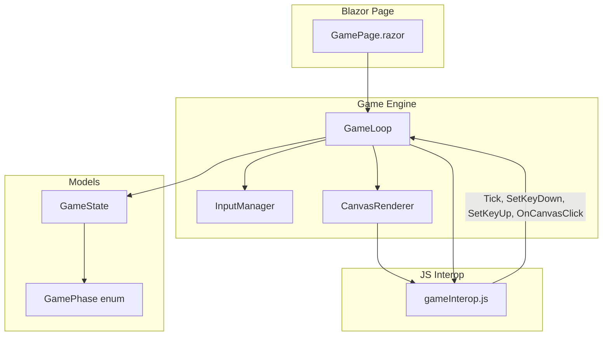
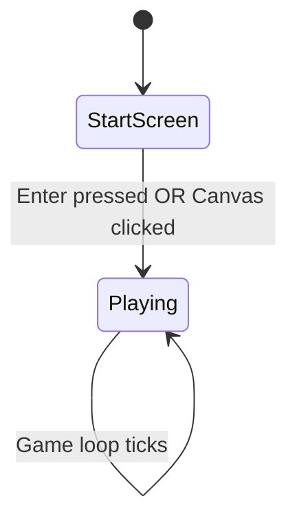
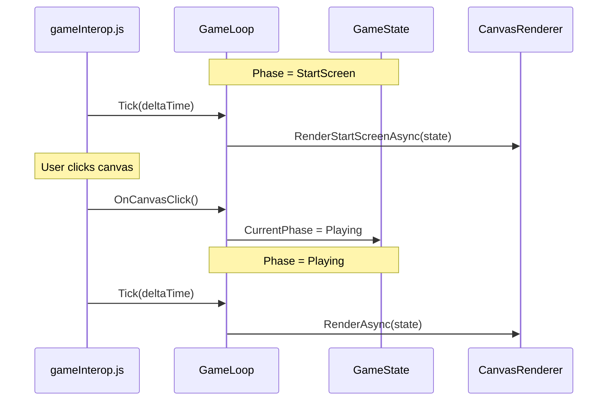

# Design Document: Start Screen

## Overview

The Frogmageddon game currently begins gameplay immediately when the page loads. This design introduces a "start screen" state that displays a title and prompt, requiring the user to press Enter or click anywhere on the canvas before transitioning to active gameplay.

The approach adds a `GamePhase` enum to the existing `GameState` model, then gates the game loop's update/render logic on the current phase. The start screen is rendered via the existing `CanvasRenderer` and `gameInterop.js` pipeline—no additional Blazor UI overlay is needed. Input detection for the start trigger is handled through the existing `InputManager` and a new click event in the JS interop layer.

## Architecture





## Components and Interfaces

### Component 1: GamePhase Enum

**Purpose**: Represents the discrete phases the game can be in.

```csharp
namespace BlazorAsteroids.Game.Models;

public enum GamePhase
{
    StartScreen,
    Playing
}
```

### Component 2: GameState (Modified)

**Purpose**: Holds the current game phase alongside existing state.

```csharp
public class GameState : IGameState
{
    public GamePhase CurrentPhase { get; set; } = GamePhase.StartScreen;
    // ... existing properties unchanged
}
```

**Interface change** — `IGameState` gains a read-only property:

```csharp
public interface IGameState
{
    GamePhase CurrentPhase { get; }
    Player Player { get; }
    int CanvasWidth { get; }
    int CanvasHeight { get; }
    void Update(float deltaTime, Vector2 movementDirection);
}
```

### Component 3: GameLoop (Modified)

**Purpose**: Gates update/render logic on `CurrentPhase`. Handles the start trigger.

```csharp
// New method added to GameLoop
[JSInvokable]
public void OnCanvasClick()
{
    if (_gameState.CurrentPhase == GamePhase.StartScreen)
    {
        _gameState.CurrentPhase = GamePhase.Playing;
    }
}
```

**Modified Tick method** — checks phase before processing:

```csharp
[JSInvokable]
public void Tick(float deltaTimeMs)
{
    if (deltaTimeMs < 0 || !_isRunning)
        return;

    if (_gameState.CurrentPhase == GamePhase.StartScreen)
    {
        // Check for Enter key to start
        if (_inputManager.IsKeyPressed("enter"))
        {
            _gameState.CurrentPhase = GamePhase.Playing;
        }

        // Render the start screen
        _ = _renderer.RenderStartScreenAsync(_gameState);
        return;
    }

    // Existing playing logic unchanged
    float deltaTimeSec = MathF.Min(deltaTimeMs / 1000f, MAX_DELTA_TIME);
    Vector2 direction = _inputManager.GetMovementDirection();
    _gameState.Update(deltaTimeSec, direction);
    _ = _renderer.RenderAsync(_gameState);
}
```

### Component 4: InputManager (Modified)

**Purpose**: Recognizes "Enter" as a valid key so `IsKeyPressed("enter")` works.

```csharp
private static readonly HashSet<string> ValidKeys = new() { "w", "a", "s", "d", "enter" };
```

### Component 5: IRenderer (Modified)

**Purpose**: Adds a method to render the start screen overlay.

```csharp
public interface IRenderer
{
    Task InitializeAsync(ElementReference canvas);
    Task RenderAsync(GameState state);
    Task RenderStartScreenAsync(GameState state);
    Task ClearAsync();
}
```

### Component 6: CanvasRenderer (Modified)

**Purpose**: Implements start screen rendering — draws title text and prompt.

```csharp
public async Task RenderStartScreenAsync(GameState state)
{
    await ClearAsync();

    if (_module is not null)
    {
        await _module.InvokeVoidAsync("drawStartScreen",
            _canvas,
            state.CanvasWidth,
            state.CanvasHeight);
    }
}
```

### Component 7: gameInterop.js (Modified)

**Purpose**: Adds canvas click listener that calls back to C#, and a `drawStartScreen` function.

```javascript
// Inside initializeGame — add click listener
canvasElement.addEventListener('click', () => {
    dotNetRef.invokeMethodAsync('OnCanvasClick');
});

// New exported function
export function drawStartScreen(canvasElement, width, height) {
    const ctx = canvasElement.getContext('2d');
    ctx.clearRect(0, 0, width, height);

    // Title
    ctx.fillStyle = 'white';
    ctx.font = 'bold 48px monospace';
    ctx.textAlign = 'center';
    ctx.fillText('FROGMAGEDDON', width / 2, height / 2 - 40);

    // Prompt
    ctx.font = '20px monospace';
    ctx.fillStyle = '#aaaaaa';
    ctx.fillText('Press ENTER or Click to Start', width / 2, height / 2 + 30);
}
```

## Data Models

### GamePhase Enum

```csharp
public enum GamePhase
{
    StartScreen,
    Playing
}
```

**Validation Rules**:
- `GameState.CurrentPhase` defaults to `StartScreen`
- Transition from `StartScreen` → `Playing` is one-way (no return to start screen in this iteration)

## Correctness Properties

The following properties must hold for the start-screen feature and are suitable for property-based testing:

### Property 1: Initial Phase Invariant

For any newly constructed `GameState`, `CurrentPhase` is always `GamePhase.StartScreen`. No sequence of constructor arguments or initialization paths may produce a `GameState` that begins in any other phase.

### Property 2: Start Trigger Exclusivity

The transition from `StartScreen` to `Playing` occurs if and only if the input is an Enter key press OR a canvas click event. For all other inputs (WASD keys, arbitrary key presses, mouse move, etc.) received while in `StartScreen` phase, `CurrentPhase` remains `StartScreen`.

### Property 3: Transition Idempotency

Once `CurrentPhase == GamePhase.Playing`, any subsequent Enter key press or canvas click event does not change `CurrentPhase`. The phase remains `Playing` regardless of how many start-trigger inputs are received after the initial transition.

### Property 4: StartScreen Freezes Game State

While `CurrentPhase == GamePhase.StartScreen`, for any number of `Tick(deltaTime)` calls with any `deltaTime` value, the player's position, velocity, and all other gameplay state remain unchanged. Only rendering of the start screen occurs — no `GameState.Update()` is invoked.

## Error Handling

### Error Scenario 1: Canvas Click Before Initialization

**Condition**: User clicks the canvas before `initializeGame` completes  
**Response**: The click listener is only registered inside `initializeGame`, so premature clicks are simply ignored  
**Recovery**: N/A — no error state

### Error Scenario 2: Multiple Start Triggers Simultaneously

**Condition**: User presses Enter and clicks at the same time during start screen  
**Response**: Both handlers check `CurrentPhase == StartScreen` before transitioning. The first one transitions to `Playing`; the second finds it already `Playing` and does nothing  
**Recovery**: N/A — idempotent transition

### Error Scenario 3: Enter Key During Gameplay

**Condition**: User presses Enter while already in `Playing` phase  
**Response**: Enter is added to `ValidKeys` in `InputManager` but has no effect during gameplay since `GetMovementDirection()` only checks WASD. The `Tick` method only checks Enter when `CurrentPhase == StartScreen`  
**Recovery**: N/A — no unintended behavior

## Testing Strategy

### Unit Testing Approach

- **GameState phase transitions**: Verify `CurrentPhase` starts as `StartScreen` and can transition to `Playing`
- **GameLoop.Tick in StartScreen phase**: Verify no position updates occur, `RenderStartScreenAsync` is called
- **GameLoop.Tick in Playing phase**: Verify existing behavior unchanged (movement, rendering)
- **GameLoop.OnCanvasClick**: Verify transitions from `StartScreen` to `Playing`, no-op when already `Playing`
- **InputManager**: Verify "enter" is tracked correctly via `SetKeyDown`/`IsKeyPressed`

### Integration Testing Approach

- End-to-end test: Load page → verify start screen renders → press Enter → verify gameplay begins
- End-to-end test: Load page → verify start screen renders → click canvas → verify gameplay begins

## Sequence Diagrams

### Start Screen → Gameplay Transition (Enter Key)

```mermaid
sequenceDiagram
    participant JS as gameInterop.js
    participant GL as GameLoop
    participant IM as InputManager
    participant GS as GameState
    participant CR as CanvasRenderer

    Note over GL,GS: Phase = StartScreen
    JS->>GL: Tick(deltaTime)
    GL->>IM: IsKeyPressed("enter")
    IM-->>GL: false
    GL->>CR: RenderStartScreenAsync(state)
    CR->>JS: drawStartScreen(canvas, w, h)

    Note over JS: User presses Enter
    JS->>GL: SetKeyDown("enter")
    GL->>IM: SetKeyDown("enter")

    JS->>GL: Tick(deltaTime)
    GL->>IM: IsKeyPressed("enter")
    IM-->>GL: true
    GL->>GS: CurrentPhase = Playing
    Note over GL,GS: Phase = Playing
    GL->>IM: GetMovementDirection()
    GL->>GS: Update(deltaTime, direction)
    GL->>CR: RenderAsync(state)
```



### Start Screen → Gameplay Transition (Click)



## Dependencies

- No new external dependencies required
- All changes use existing Blazor JSInterop and Canvas 2D API
- Leverages existing `gameInterop.js` module pattern
